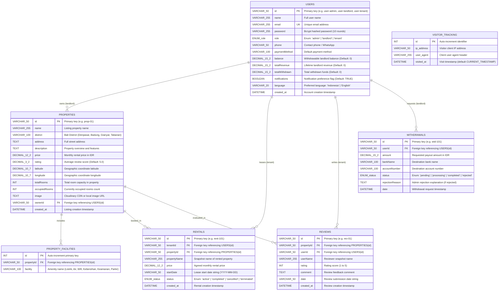
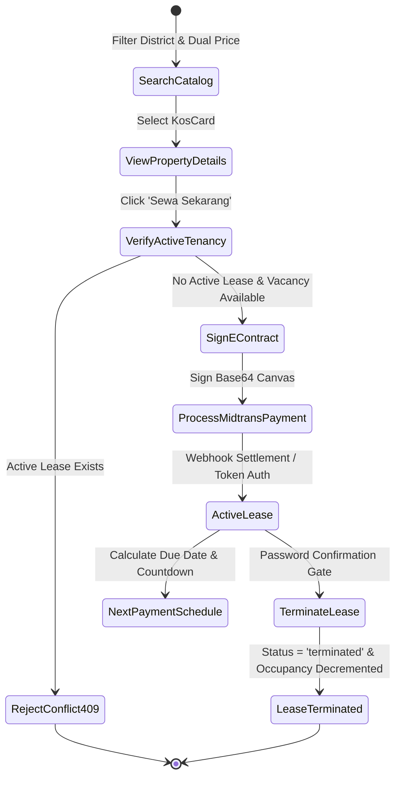
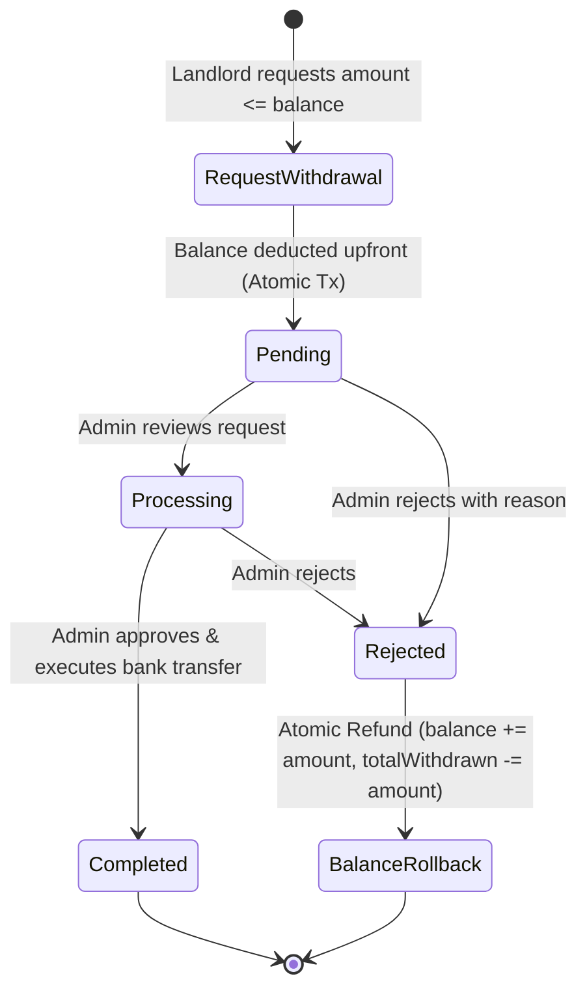

# KOSMO Bali Co-Living Marketplace — Production Technical Handoff

> **Document Version:** 2.0.0 (Production Release)  
> **Repository:** `KOSMO-landing-page`  
> **Last Verified:** August 2026  
> **Target Environment:** Node.js (Standalone Server & Vercel Serverless) + TiDB Serverless Cloud (AWS Singapore `ap-southeast-1`)

---

## 1. Executive Overview & System Topology

### 1.1 Business Model & Core Concept
**KOSMO** is an all-inclusive co-living and long-term rental marketplace specifically tailored for Bali, Indonesia (covering Denpasar, Badung/Canggu/Seminyak/Kuta, Gianyar/Ubud, and Tabanan).

- **All-Inclusive Model:** Monthly rental rates bundle all essential utilities into a single predictable invoice without hidden fees:
  - Electricity (Token PLN included up to normal usage threshold)
  - Water (PDAM / Deep Well filtered water)
  - High-Speed WiFi (100 Mbps fiber optic with backup failover)
  - Bi-weekly Room Cleaning & Linen Change
  - 24/7 On-site Security & Smart Lock Access
  - Dedicated Motorbike/Car Parking
- **Three-Tier User Ecosystem:**
  1. **Tenants (Penyewa):** Search properties using dual min/max budget range filters, review amenities, inspect interactive Leaflet maps, digitally sign bilingual rental contracts, pay via Midtrans Snap, track next payment due dates, and manage ongoing tenancies from the Tenant Dashboard.
  2. **Landlords (Pemilik Kos):** Manage property listings, inspect occupancy rates, track rental revenue in real-time with automated SQL aggregations, view active tenant contracts, and request payouts via bank transfers.
  3. **Admins:** Oversee the marketplace, moderate property listings, inspect global platform metrics and visitor analytics, approve or reject landlord withdrawal requests with atomic balance rollback guarantees, and maintain user accounts.

---

### 1.2 System Architecture Diagram

```mermaid
graph TD
    Client["React 19 + Vite SPA<br/>(Tailwind CSS, Lucide, Leaflet)"]
    Server["Express TypeScript API<br/>(Node.js / Vercel Serverless)"]
    Cache["In-Memory API Response Cache<br/>(backend/services/cache.ts)"]
    DB[("TiDB Serverless Cloud<br/>AWS Singapore (MySQL 8.0 Protocol)")]
    Midtrans["Midtrans Snap Gateway<br/>(Sandbox / Production Payment API)"]
    Cloudinary["Cloudinary CDN<br/>(Asset Storage & Streaming)"]

    Client -->|HTTP/REST + Bearer JWT| Server
    Server -->|Read / Write TTL Caching| Cache
    Server -->|Persistent Pool (mysql2/promise)| DB
    Server -->|Create Transaction / Webhook Verifications| Midtrans
    Server -->|Multipart Image Upload Stream| Cloudinary
```

---

### 1.3 Full-Stack Technology Matrix

| Layer | Dependency & Exact Version | Purpose & Architectural Rationale |
| :--- | :--- | :--- |
| **Backend Runtime** | Node.js (>=18.0.0), `tsx` (^4.23.12) | High-performance TypeScript execution without separate transpile step |
| **HTTP Server** | `express` (^4.21.1) | Modular routing, middleware pipelines, and REST handlers |
| **Language & Typing**| TypeScript (^7.0.2 / 5.3 strict) | End-to-end type safety across domain interfaces, API contracts, and database queries |
| **Database Driver** | `mysql2` (^3.22.5) with Promise API | High-throughput connection pooling with SSL support against TiDB Cloud |
| **Security & Auth** | `jsonwebtoken` (^9.0.3), `bcryptjs` (^3.0.3) | Stateless signed JWTs (7d expiration), bcrypt hashing (10 salt rounds), password confirmation gates |
| **Network Traffic** | `compression` (^1.8.1), `cors` (^2.8.5), `helmet` (^8.3.0) | Gzip/Brotli payload compression, Cross-Origin Resource Sharing, and HTTP security headers |
| **Document Engine** | `pdfkit` (^0.19.1) | Programmatic PDF contract generation with digital signature embedding and standard fonts |
| **Media Uploads** | `multer` (^2.2.0), `cloudinary` (^2.10.0)| Memory buffer storage, MIME type validation, and streaming upload to Cloudinary CDN |
| **Spreadsheets** | `xlsx` (^0.18.5) | Automated binary workbook export for financial and tracking reports |
| **Frontend Runtime** | React (^19.2.6), React DOM (^19.2.6) | Modern concurrent SPA architecture with hooks, Suspense, and state containers |
| **Routing** | `react-router-dom` (^7.18.0) | Client-side routing, protected routes, and role-based redirects |
| **Bundler & Build** | `vite` (^5.4.11), `@vitejs/plugin-react` | Ultra-fast HMR and optimized production bundle chunking |
| **Design & UI** | Tailwind CSS (^3.4.19), Lucide React (^1.21.0) | Responsive design system, CSS variables, dark mode (`class`), and iconography |
| **Maps & Location** | Leaflet OpenStreetMap (`leaflet.d.ts`) | Interactive map view and geo-coordinate marker rendering |
| **Unit Testing** | `vitest` (^4.1.10), `@testing-library/react` | Isolated component unit tests and render latency assertions |
| **E2E Testing** | `@playwright/test` (^1.62.1) | Chromium end-to-end browser tests across real user journeys |

---

### 1.4 Annotated Directory Tree

```
KOSMO-landing-page/
├── .agents/                        # AI Workspace rules and execution standards
│   └── rules/workspace-rules.md    # Operating rules, zero-any policy, commit rules
├── api/                            # Vercel Serverless deployment entrypoint
│   └── index.js                    # Serverless bridge wrapping backend/server.ts
├── backend/                        # Backend REST API architecture
│   ├── db/                         # Legacy JSON files (preserved/unreferenced)
│   ├── middleware/                 # Express middleware suite
│   │   ├── auth.ts                 # JWT verification, payload decode, requireRole guard
│   │   ├── upload.ts               # Multer memory storage & MIME type validation
│   │   └── validation.ts           # Zod payload schema validators
│   ├── services/                   # Business domain services
│   │   ├── cache.ts                # TTL-based in-memory cache with wildcard invalidation
│   │   ├── cloudinary.ts           # Cloudinary SDK buffer streaming & URL resolver
│   │   └── contract.ts             # PDFKit legal rental contract generator
│   ├── types/                      # Domain interfaces (User, Property, Rental, Withdrawal)
│   ├── uploads/                    # Local storage directory for generated PDF documents
│   ├── db.ts                       # Persistent connection pool & schema auto-initialization
│   ├── router.ts                   # REST API route handlers & SQL transactions
│   ├── server.ts                   # Express server initialization, middleware stack, listener
│   └── tsconfig.json               # Backend TypeScript configuration
├── frontend/                       # React 19 SPA client
│   ├── src/
│   │   ├── components/             # Reusable UI components
│   │   │   ├── __tests__/          # Vitest component unit tests
│   │   │   ├── BookingModal.tsx    # Details, e-contract signing, and checkout modal
│   │   │   ├── ErrorBoundary.tsx   # React runtime error boundary
│   │   │   ├── KosCard.tsx         # Property card item with async image decoding
│   │   │   ├── KosCardSkeleton.tsx # Shimmer pulse loading skeleton
│   │   │   ├── SearchFilterBar.tsx # Dual min/max price filter & district selector
│   │   │   └── ThemeLanguageToggle.tsx # Dark mode and ID/EN language toggle
│   │   ├── context/                # Global React context providers
│   │   │   ├── LanguageContext.tsx # Bilingual translation engine (ID / EN)
│   │   │   └── ThemeContext.tsx    # Dark/Light theme manager with system scheme detection
│   │   ├── pages/                  # Route-level page components
│   │   │   ├── AdminDashboard.tsx  # Admin moderation, users, and withdrawals
│   │   │   ├── LandingPage.tsx     # Public catalog, hero search, all-inclusive overview
│   │   │   ├── LandlordDashboard.tsx# Financial ledger, property CRUD, tenant roster
│   │   │   ├── Login.tsx           # Authentication page (Login & Registration)
│   │   │   └── TenantDashboard.tsx # Tenancy contracts, next payment due dates, and profile
│   │   ├── types/                  # Frontend domain models & Leaflet type definitions
│   │   ├── App.tsx                 # Root router wrapped in ThemeProvider and LanguageProvider
│   │   └── index.css               # Design tokens, dark mode variables, and utilities
│   └── vite.config.ts              # Vite bundler configuration & proxies
├── scripts/                        # Operational, verification, and audit helper scripts
│   ├── audit_performance.ts        # Automated endpoint latency & payload audit
│   ├── backend.sh                  # Start backend dev server (`npx tsx backend/server.ts`)
│   ├── compare_performance.ts      # Latency benchmarking script
│   ├── frontend.sh                 # Start frontend dev server (`npm --prefix frontend run dev`)
│   ├── seed.ts                     # Automated database reset & Bali property seed script
│   └── verify.sh                   # Mandatory 5-gate verification suite
├── tests/                          # Automated backend & E2E test suites
│   ├── e2e/                        # Playwright E2E browser tests
│   │   ├── auth_roles.spec.ts      # Multi-role authentication & redirect tests
│   │   ├── perf_webvitals.spec.ts  # Core Web Vitals performance benchmarks
│   │   ├── rental_flow.spec.ts     # Full real registration -> booking -> tenant E2E test
│   │   └── search_and_book.spec.ts # Catalog search, price filter, modal tests
│   ├── auth.test.ts                # Authentication, password hashing, and role guard tests
│   ├── contract.test.ts            # PDF contract generator and e-signature embedding tests
│   ├── db_integration.test.ts      # Live MySQL table integrity & rollback tests
│   ├── jwt.test.ts                 # JWT signing, claims verification, and expiration tests
│   ├── payment.test.ts             # Midtrans SHA-512 signature & webhook transition tests
│   ├── perf_api.test.ts            # Response time SLAs & payload size benchmarks
│   ├── perf_db.test.ts             # Raw SQL JOIN & pool query benchmarks
│   ├── rentals.test.ts             # Rental transactions, single tenancy, & payment schedule tests
│   ├── router.test.ts              # REST API endpoint registration tests
│   ├── search.test.ts              # Search & multi-parameter filter logic tests
│   ├── types.test.ts               # Domain schema boundary & data validation tests
│   ├── upload.test.ts              # Cloudinary upload & MIME type validation tests
│   └── withdrawals.test.ts         # Landlord withdrawal state machine & refund rollback tests
├── package.json                    # Workspace root scripts & dependencies
├── playwright.config.ts            # Playwright browser test runner configuration
└── PROJECT_HANDOFF.md              # Authoritative technical handoff guide (this file)
```

---

## 2. Domain Model, Relational Schema & Storage Engine

### 2.1 Entity Relationship Diagram (ERD)



---

### 2.2 Relational Schema Specifications

#### 1. `users` Table
```sql
CREATE TABLE IF NOT EXISTS users (
  id VARCHAR(50) PRIMARY KEY,
  name VARCHAR(255) NOT NULL,
  email VARCHAR(255) UNIQUE NOT NULL,
  password VARCHAR(255) NOT NULL,
  role ENUM('admin', 'landlord', 'tenant') NOT NULL,
  phone VARCHAR(50) DEFAULT '',
  paymentMethod VARCHAR(100) DEFAULT 'Virtual Account',
  balance DECIMAL(15, 2) DEFAULT 0,
  totalRevenue DECIMAL(15, 2) DEFAULT 0,
  totalWithdrawn DECIMAL(15, 2) DEFAULT 0,
  notifications BOOLEAN DEFAULT TRUE,
  language VARCHAR(20) DEFAULT 'Indonesia',
  created_at TIMESTAMP DEFAULT CURRENT_TIMESTAMP
);
```

#### 2. `properties` Table
```sql
CREATE TABLE IF NOT EXISTS properties (
  id VARCHAR(50) PRIMARY KEY,
  name VARCHAR(255) NOT NULL,
  district VARCHAR(100) NOT NULL,
  address TEXT,
  description TEXT,
  price DECIMAL(12, 2) NOT NULL,
  rating DECIMAL(3, 2) DEFAULT 5.0,
  latitude DECIMAL(10, 7) DEFAULT -8.670458,
  longitude DECIMAL(10, 7) DEFAULT 115.212629,
  totalRooms INT DEFAULT 5,
  occupiedRooms INT DEFAULT 0,
  image TEXT,
  ownerId VARCHAR(50),
  created_at TIMESTAMP DEFAULT CURRENT_TIMESTAMP,
  FOREIGN KEY (ownerId) REFERENCES users(id) ON DELETE SET NULL
);
```

#### 3. `property_facilities` Table
```sql
CREATE TABLE IF NOT EXISTS property_facilities (
  id INT AUTO_INCREMENT PRIMARY KEY,
  propertyId VARCHAR(50) NOT NULL,
  facility VARCHAR(100) NOT NULL,
  FOREIGN KEY (propertyId) REFERENCES properties(id) ON DELETE CASCADE
);
```

#### 4. `rentals` Table
```sql
CREATE TABLE IF NOT EXISTS rentals (
  id VARCHAR(50) PRIMARY KEY,
  tenantId VARCHAR(50) NOT NULL,
  propertyId VARCHAR(50) NOT NULL,
  propertyName VARCHAR(255) NOT NULL,
  price DECIMAL(12, 2) NOT NULL,
  startDate VARCHAR(50) NOT NULL,
  status ENUM('active', 'completed', 'cancelled', 'terminated') DEFAULT 'active',
  created_at TIMESTAMP DEFAULT CURRENT_TIMESTAMP,
  FOREIGN KEY (tenantId) REFERENCES users(id) ON DELETE CASCADE,
  FOREIGN KEY (propertyId) REFERENCES properties(id) ON DELETE CASCADE
);
```

#### 5. `withdrawals` Table
```sql
CREATE TABLE IF NOT EXISTS withdrawals (
  id VARCHAR(50) PRIMARY KEY,
  userId VARCHAR(50) NOT NULL,
  amount DECIMAL(15, 2) NOT NULL,
  bankName VARCHAR(100) NOT NULL,
  accountNumber VARCHAR(100) NOT NULL,
  status ENUM('pending', 'processing', 'completed', 'rejected') DEFAULT 'pending',
  rejectionReason TEXT,
  date TIMESTAMP DEFAULT CURRENT_TIMESTAMP,
  FOREIGN KEY (userId) REFERENCES users(id) ON DELETE CASCADE
);
```

#### 6. `reviews` Table
```sql
CREATE TABLE IF NOT EXISTS reviews (
  id VARCHAR(50) PRIMARY KEY,
  propertyId VARCHAR(50) NOT NULL,
  userId VARCHAR(50) NOT NULL,
  userName VARCHAR(255) NOT NULL,
  rating INT NOT NULL,
  comment TEXT,
  date VARCHAR(50) NOT NULL,
  created_at TIMESTAMP DEFAULT CURRENT_TIMESTAMP,
  FOREIGN KEY (propertyId) REFERENCES properties(id) ON DELETE CASCADE,
  FOREIGN KEY (userId) REFERENCES users(id) ON DELETE CASCADE
);
```

#### 7. `visitor_tracking` Table
```sql
CREATE TABLE IF NOT EXISTS visitor_tracking (
  id INT AUTO_INCREMENT PRIMARY KEY,
  ip_address VARCHAR(50),
  user_agent VARCHAR(255),
  visited_at TIMESTAMP DEFAULT CURRENT_TIMESTAMP
);
```

---

### 2.3 Active Index Inventory
Indexes are initialized on application boot via `ensureIndexes()` in `backend/db.ts`:

| Table | Index Name | Indexed Columns | Performance Purpose & Query Acceleration |
| :--- | :--- | :--- | :--- |
| `properties` | `idx_properties_district_price` | `(district, price)` | Speeds up catalog filtering by district and budget range in `GET /api/properties`. |
| `properties` | `idx_properties_owner` | `(ownerId)` | Accelerates landlord property queries and SQL room aggregations in `GET /api/landlord/stats`. |
| `rentals` | `idx_rentals_tenant_status` | `(tenantId, status)` | Fast tenancy lookup for Tenant Dashboard and Single Active Tenancy validation. |
| `rentals` | `idx_rentals_property_status` | `(propertyId, status)` | Instant occupancy rate calculations (`occupiedRooms / totalRooms`) in landlord dashboards. |
| `visitor_tracking` | `idx_visited_at` | `(visited_at)` | Accelerates admin analytics date-range filters (`GET /api/admin/tracking-history`). |
| `withdrawals` | `idx_withdrawals_user_date` | `(userId, date)` | Optimizes landlord financial transaction ledger history lookups. |
| `withdrawals` | `idx_withdrawals_user_status` | `(userId, status)` | Speeds up pending withdrawal verification and admin payout queues. |

---

### 2.4 Connection Pooling Configuration
Located in [`backend/db.ts`](file:///d:/Project/KOSMO_WEB_MOBILE/KOSMO-landing-page/backend/db.ts):

```typescript
export const pool = mysql.createPool({
  host: process.env.DB_HOST || 'gateway01.ap-southeast-1.prod.aws.tidbcloud.com',
  port: parseInt(process.env.DB_PORT || '4000', 10),
  user: process.env.DB_USER || '279JPYgaVYKwVMe.root',
  password: process.env.DB_PASSWORD,
  database: process.env.DB_NAME || 'kosmo_db',
  ssl: { minVersion: 'TLSv1.2', rejectUnauthorized: true },
  waitForConnections: true,
  connectionLimit: 10,
  maxIdle: 10,
  idleTimeout: 60000,
  queueLimit: 0
});
```

---

## 3. Role-Based Lifecycles & State Machine Specifications

### 3.1 Tenant Lifecycle (Penyewa)



1. **Search & Dual Price Filtering:**
   - Evaluates minimum and maximum price boundaries concurrently:
     $$\text{priceMin} \le \text{property.price} \le \text{priceMax}$$
   - When $\text{priceMin} > \text{priceMax}$, immediately returns an empty array without executing heavy queries.
2. **Single Active Tenancy Enforcement:**
   - Prior to issuing a Midtrans transaction token (`POST /api/payment/token`) or registering a lease (`POST /api/rentals`), the backend verifies active rentals:
     ```sql
     SELECT id, propertyName FROM rentals WHERE tenantId = ? AND status = 'active' LIMIT 1;
     ```
   - If an active lease exists, the endpoint rejects immediately with `HTTP 409 Conflict`:
     ```json
     {
       "message": "Anda masih memiliki sewa kos yang aktif (KOSMO Hub Denpasar). Harap selesaikan atau batalkan sewa berjalan sebelum menyewa unit baru."
     }
     ```
3. **Next Payment Schedule Engine:**
   - Monthly lease anniversary date calculation based on `startDate`:
     - Advances month by month iteratively until $\text{dueDate} > \text{currentDate}$.
     - Computes `daysRemaining`: $\lceil (\text{dueDate} - \text{currentDate}) / 86400000 \rceil$.
     - Computes status: `'Lunas (Periode Berjalan)'` if $\text{daysRemaining} > 3$, `'Menjelang Jatuh Tempo'` if $\text{daysRemaining} \le 3$.
4. **Tenant Dashboard Separation:**
   - **Hunian Aktif Saya:** Displays active property card, Next Due Date badge, countdown, `Unduh Kontrak Sewa (PDF)`, and `Berhenti Menyewa` button.
   - **Riwayat Sewa Masa Lalu:** Lists completed and terminated historical leases.

---

### 3.2 Landlord Operations & Withdrawal State Machine



1. **Real-Time SQL Financial Aggregations:**
   - Avoids memory-heavy JavaScript loops by querying TiDB using SQL aggregation:
     ```sql
     SELECT 
       DATE_FORMAT(created_at, '%Y-%m') AS month,
       COALESCE(SUM(price), 0) AS totalRevenue,
       COUNT(*) AS totalTransactions
     FROM rentals
     WHERE propertyId IN (SELECT id FROM properties WHERE ownerId = ?)
       AND status IN ('active', 'completed')
     GROUP BY DATE_FORMAT(created_at, '%Y-%m')
     ORDER BY month ASC;
     ```
2. **Withdrawal Transaction Safety & Refund Guarantee:**
   - When a landlord requests a payout, the requested `amount` is deducted upfront from `users.balance` within a database transaction.
   - If the admin rejects the payout (`POST /api/admin/withdrawals/:id/reject`), the funds are refunded atomically to the landlord's balance using `SELECT ... FOR UPDATE` row-level locking.

---

### 3.3 Admin Governance & Platform Moderation
- **System-Wide Metric Aggregations:** Global gross volume, platform occupancy rate, active listings count, and tenant/landlord user counts.
- **Visitor Tracking & Historical Analytics:** Records daily and hourly visitor IPs and user-agent strings, rendering line charts with 24h, 7d, and 30d views.
- **Password-Gated Moderation:** Deleting properties or terminating rentals requires explicit password confirmation.

---

## 4. Frontend Design System & Key Features

### 4.1 Theme System (Light & Dark Mode)
- **Architecture:** Managed via `ThemeContext.tsx` with light/dark state, system preference fallback (`prefers-color-scheme: dark`), and local storage persistence (`kosmo_theme`).
- **Tailwind Setup:** `darkMode: 'class'` in `tailwind.config.js`.
- **CSS Token System (`index.css`):**
  ```css
  :root {
    --bg-main: #f8fafc;
    --bg-card: #ffffff;
    --text-main: #0f172a;
    --text-muted: #64748b;
    --border-color: #e2e8f0;
  }
  .dark {
    --bg-main: #020617;
    --bg-card: #0f172a;
    --text-main: #f8fafc;
    --text-muted: #94a3b8;
    --border-color: #1e293b;
  }
  ```

---

### 4.2 Internationalization (i18n)
- **Provider & Dictionary:** `LanguageContext.tsx` provides comprehensive translations for Indonesian (`id`) and English (`en`).
- **Persistence & Synchronization:** Language choice is stored in `localStorage` (`kosmo_language`) and synced with the database via `PUT /api/auth/profile`.
- **ThemeLanguageToggle Component:** Integrated into header bars across Landing Page, Tenant Dashboard, Landlord Dashboard, Admin Dashboard, and Login portal with mobile-friendly touch targets (>= 44x44px).

---

### 4.3 Component Architecture & Form Hygiene
1. **`SearchFilterBar.tsx`:**
   - Responsive 12-column CSS Grid: `grid grid-cols-1 md:grid-cols-12 gap-3.5 items-end`.
   - Currency Prefix Hygiene: `absolute left-3.5 top-1/2 -translate-y-1/2` with `pl-10 pr-3` padding.
   - Standard uniform height across select, inputs, and action buttons (`h-11 rounded-xl`).
   - Lucide icons for all filter controls: `MapPin`, `ArrowDownCircle`, `ArrowUpCircle`, `Search`, `RotateCcw`, `SlidersHorizontal`.
2. **`BookingModal.tsx`:**
   - Multi-step modal containing property amenity details, interactive Leaflet geo-map, canvas-based digital signature e-contract, and Midtrans checkout gateway.
3. **`KosCardSkeleton.tsx`:**
   - Shimmer pulse placeholder cards preventing Cumulative Layout Shift (CLS) during asynchronous property fetching.

---

## 5. Security, Cryptography & Environment Matrix

### 5.1 Midtrans Webhook Cryptographic Verification
To prevent fraudulent payment spoofing, incoming webhook notifications from Midtrans are validated using SHA-512 cryptographic hash matching:

$$\text{Calculated Signature} = \text{SHA-512}(\text{order\_id} + \text{status\_code} + \text{gross\_amount} + \text{MIDTRANS\_SERVER\_KEY})$$

```typescript
const payload = `${order_id}${status_code}${gross_amount}${process.env.MIDTRANS_SERVER_KEY}`;
const computedSignature = crypto.createHash('sha512').update(payload).digest('hex');

if (computedSignature.toLowerCase() !== signature_key.toLowerCase()) {
  return res.status(403).json({ message: 'Invalid cryptographic signature' });
}
```

---

### 5.2 Security & Authentication Guardrails
- **Bcrypt Password Security:** 10 salt rounds used for all password hashes. Raw passwords are never returned in responses.
- **SQL Injection Prevention:** All SQL queries in `backend/router.ts` and `backend/db.ts` use prepared statements with parameterized inputs (`?`).
- **Destructive Action Gates:** Destructive operations (`DELETE /api/properties/:id`, `POST /api/rentals/:id/terminate`) enforce password re-verification via `POST /api/auth/verify-password`.
- **JWT Authorization:** Standard Bearer tokens with 7-day expiration containing `{ id, email, role }` claims.

---

### 5.3 Environment Configuration Reference

| Variable Name | Required | Default / Sample Value | Description |
| :--- | :--- | :--- | :--- |
| `PORT` | Optional | `5000` | Port for Express API server |
| `NODE_ENV` | Optional | `development` / `production` | Environment mode flag |
| `DB_HOST` | **Required** | `gateway01.ap-southeast-1.prod.aws.tidbcloud.com` | TiDB Cloud database host |
| `DB_PORT` | **Required** | `4000` | TiDB Cloud database port |
| `DB_USER` | **Required** | `279JPYgaVYKwVMe.root` | Database username |
| `DB_PASSWORD` | **Required** | *(Secret)* | Database password |
| `DB_NAME` | **Required** | `kosmo_db` | Target database name |
| `DB_SSL` | **Required** | `true` | Enforces TLSv1.2 connection encryption |
| `JWT_SECRET` | **Required** | `kosmo-super-secret-key-bali-2026` | Key used for signing/verifying JWTs |
| `MIDTRANS_SERVER_KEY` | **Required** | `Mid-server-...` | Midtrans payment gateway server key |
| `MIDTRANS_CLIENT_KEY` | **Required** | `Mid-client-...` | Midtrans client-side Snap key |
| `MIDTRANS_IS_PRODUCTION`| **Required**| `false` | Midtrans sandbox vs production toggle |
| `CLOUDINARY_CLOUD_NAME`| **Required** | `dpv4c9kvy` | Cloudinary CDN cloud identifier |
| `CLOUDINARY_API_KEY` | **Required** | `585721731671569` | Cloudinary API access key |
| `CLOUDINARY_API_SECRET`| **Required** | *(Secret)* | Cloudinary API secret |

---

## 6. Verification Pipeline, Operational Playbook & Runbook

### 6.1 5-Gate Verification Pipeline
Before any deployment or Git commit, all 5 verification gates in `./scripts/verify.sh` must pass with exit code 0:

```bash
# Gate 1: Strict Backend TypeScript Compilation
npx tsc --noEmit --project backend/tsconfig.json

# Gate 2: Frontend Production Build Minification
npm --prefix frontend run build

# Gate 3: Backend Domain & Unit Test Suite
npm test

# Gate 4: Frontend Vitest Component Tests
npm --prefix frontend test -- --run

# Gate 5: Playwright End-to-End Browser Tests
npx playwright test
```

---

### 6.2 CLI Command Reference

| Action | Command Line |
| :--- | :--- |
| **Start Backend API** | `npm run dev:backend` *(starts tsx watch on backend/server.ts)* |
| **Start Frontend Client** | `npm --prefix frontend run dev` *(starts Vite dev server on port 5173)* |
| **Reset & Seed Database** | `npx tsx scripts/seed.ts` *(clears transactional data, preserves users, seeds Bali kos)* |
| **Run Unit Tests** | `npm test` |
| **Run Integration Tests**| `npm run test:integration` |
| **Run Playwright E2E** | `npx playwright test` |
| **Run Full Verification**| `./scripts/verify.sh` |

---

### 6.3 Operational Failure Modes & Troubleshooting Runbook

| Symptom | Root Cause | Resolution Procedure |
| :--- | :--- | :--- |
| **`ETIMEDOUT` / `ECONNREFUSED` on Database Queries** | TiDB Serverless cluster pause or network firewall block. | 1. Verify `DB_HOST`, `DB_PORT`, and `DB_PASSWORD` in `.env`.<br/>2. Ensure `ssl: { minVersion: 'TLSv1.2', rejectUnauthorized: true }` is enabled.<br/>3. Test direct ping: `npx tsx scripts/inspect_live_db.ts`. |
| **Midtrans Snap Popup Fails to Open** | Client key mismatch or invalid order payload. | 1. Ensure `index.html` includes `https://app.sandbox.midtrans.com/snap/snap.js`.<br/>2. Verify `MIDTRANS_SERVER_KEY` and `MIDTRANS_CLIENT_KEY` match in `.env`. |
| **`409 Conflict` on Rental Booking** | Tenant already has an active lease (`status = 'active'`). | Single Active Tenancy rule working as designed. Tenant must terminate their current lease from the Tenant Dashboard before renting another property. |
| **`401 Unauthorized` on Rental Termination** | Missing JWT Authorization header. | Ensure requests send `headers: { 'Authorization': 'Bearer ' + token }`. |
| **PDF Contract Download Fails in Serverless** | Read-only filesystem on serverless cloud (Vercel). | `backend/services/contract.ts` generates in-memory buffers fallback when filesystem writes are blocked. |

---

## 7. Technical Debt & Prioritized Roadmap

### 7.1 Identified Technical Debt
1. **Local Contract PDF Storage:** Generated PDF contracts are currently saved to `backend/uploads/` on standalone servers and buffered in serverless mode. Long-term storage should stream directly to Cloudinary or AWS S3 buckets.
2. **Automated Image Optimization:** Listing uploads are streamed directly to Cloudinary. Adding a client-side or server-side Sharp/WebP compression step will reduce upload bandwidth on mobile networks.

---

### 7.2 Prioritized Development Roadmap

#### Phase 1 (Near-Term: P0 / P1)
- [ ] **Cloud PDF Streaming:** Stream generated rental agreements directly to Cloudinary / AWS S3 and store permanent CDN URLs in `rentals.contractUrl`.
- [ ] **Automated Billing Cron Job:** Node cron schedule to check leases approaching their `nextPaymentDate` and generate recurring Midtrans payment tokens.
- [ ] **Automated Image Resizing:** Pre-process image buffers using Sharp to generate WebP thumbnails (400x300) and high-res variants (1200x800).

#### Phase 2 (Medium-Term: P2 / P3)
- [ ] **WhatsApp & Email Reminders:** Automated Twilio / SendGrid notifications for rent due dates 3 days prior to expiration.
- [ ] **Real-Time Landlord-Tenant Chat:** WebSocket / Socket.io channel enabling direct messaging between tenants and property owners.
- [ ] **Multi-Currency Converter:** Real-time currency exchange rates (USD, AUD, EUR, GBP) converted from IDR based on daily Bank Indonesia API rates.

---

*Authored and verified for production release by Antigravity Engineering Team.*
