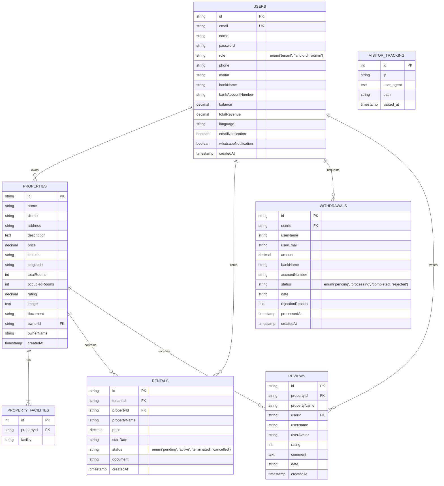

# KOSMO Bali Co-Living Marketplace — Production Technical Handoff

> **Version:** 1.0.0 (Production Release)  
> **Repository:** `KOSMO-landing-page`  
> **Last Verified:** August 2026  
> **Target Environment:** Node.js (Standalone Server & Vercel Serverless) + TiDB Serverless Cloud (AWS Singapore)

---

## 1. Executive Overview & System Architecture

### 1.1 Project Concept & Business Model
**KOSMO** is an all-inclusive co-living and long-term rental platform operating in Bali, Indonesia (covering Denpasar, Badung/Canggu/Seminyak/Kuta, Gianyar/Ubud, and Tabanan).

- **All-Inclusive Model:** Monthly rental prices bundle all essential utilities (Electricity, Water, High-Speed WiFi, Cleaning, 24/7 Security, and Parking) into a single predictable invoice without surprise fees.
- **Three-Tier User Ecosystem:**
  1. **Tenants (Penyewa):** Search properties using dual min/max budget range filters, review amenities, inspect interactive Leaflet maps, digitally sign bilingual rental contracts, pay via Midtrans Snap, and manage ongoing tenancies from the Tenant Dashboard.
  2. **Landlords (Pemilik Kos):** Manage property listings, inspect occupancy rates, track rental revenue in real-time with automated SQL aggregations, view active tenant contracts, and request payouts via bank transfers.
  3. **Admins:** Oversee the marketplace, moderate property listings, inspect global platform metrics and visitor analytics, approve or reject landlord withdrawal requests with balance rollback guarantees, and maintain user accounts.

---

### 1.2 Full-Stack Technology Matrix

```mermaid
graph TD
    Client["React 18 + Vite SPA<br/>(Tailwind CSS, Lucide, Leaflet)"]
    Server["Express TypeScript API<br/>(Node.js / Vercel Serverless)"]
    Cache["In-Memory API Response Cache<br/>(backend/services/cache.ts)"]
    DB[("TiDB Serverless Cloud<br/>AWS Singapore (MySQL 8.0 Protocol)")]
    Midtrans["Midtrans Snap Gateway<br/>(Sandbox Payment API)"]
    Cloudinary["Cloudinary CDN<br/>(Asset Storage)"]

    Client -->|HTTP/REST + JWT| Server
    Server -->|Read / Write| Cache
    Server -->|Persistent Pool (mysql2)| DB
    Server -->|Create Transaction / Webhook| Midtrans
    Server -->|Image Upload Stream| Cloudinary
```

| Layer | Technologies & Dependencies | Purpose |
| :--- | :--- | :--- |
| **Backend Runtime** | Node.js (>=18), `express` (v4.19), `tsx` | High-performance REST API routing and execution |
| **Language & Typing** | TypeScript (v5.3), strict typecheck | Full-stack type safety across models and API contracts |
| **Database Driver** | `mysql2/promise` (v3.9) with connection pooling | Thread-safe, non-blocking queries against TiDB |
| **Security & Auth** | `jsonwebtoken`, `bcrypt` (10 rounds), `compression` | JWT authorization, password hashing, and Gzip response compression |
| **Documents & Storage**| `pdfkit`, `multer`, `cloudinary` | Programmatic PDF contract generation and asset uploads |
| **Frontend Framework** | React 18, React Router DOM (v6), Vite (v5) | SPA routing, lazy tab loading, and responsive views |
| **Styling & Icons** | Tailwind CSS (v3.4), Lucide React | Modern design system, pulse skeletons, and icons |
| **Geospatial & Maps** | Leaflet OpenStreetMap (`leaflet`, `leaflet.d.ts`) | Interactive property coordinate mapping |
| **Testing Suites** | Node.js `test` runner, Vitest (v4), Playwright | Unit, integration, component, and E2E browser testing |

---

### 1.3 High-Level Directory Tree

```
KOSMO-landing-page/
├── .agents/                        # Agent workflows and workspace operating rules
│   └── rules/workspace-rules.md    # Mandatory execution standards & guardrails
├── api/                            # Vercel serverless entrypoint
│   └── index.js                    # Serverless bridge wrapping backend/server.ts
├── backend/                        # Core backend codebase
│   ├── db/                         # Legacy JSON files (preserved/unmodified)
│   ├── middleware/                 # Express middlewares (auth.ts, roles, upload.ts)
│   ├── services/                   # Business logic (cache.ts, pdf.ts, cloudinary.ts)
│   ├── types/                      # Domain interfaces (User, Property, Rental, Withdrawal)
│   ├── uploads/                    # Local uploads directory for static assets
│   ├── db.ts                       # Persistent connection pool & schema auto-initialization
│   ├── router.ts                   # REST API route handlers & SQL transactions
│   ├── server.ts                   # Express server initialization, middleware stack, listener
│   └── tsconfig.json               # Backend TypeScript configuration
├── frontend/                       # React SPA client
│   ├── src/
│   │   ├── components/             # Reusable UI components
│   │   │   ├── __tests__/          # Vitest component unit tests
│   │   │   ├── BookingModal.tsx    # Details, e-contract signing, and checkout modal
│   │   │   ├── ErrorBoundary.tsx   # React runtime error boundary
│   │   │   ├── KosCard.tsx         # Property card item with async image decoding
│   │   │   ├── KosCardSkeleton.tsx # Shimmer pulse loading skeleton
│   │   │   └── SearchFilterBar.tsx # Dual min/max price filter & district selector
│   │   ├── pages/                  # Route-level page components
│   │   │   ├── AdminDashboard.tsx  # Admin moderation, users, and withdrawals
│   │   │   ├── LandingPage.tsx     # Public catalog, hero search, all-inclusive overview
│   │   │   ├── LandlordDashboard.tsx# Financial ledger, property CRUD, tenant roster
│   │   │   ├── Login.tsx           # Authentication page (Login & Registration)
│   │   │   └── TenantDashboard.tsx # Tenancy contracts, receipts, and user profile
│   │   ├── types/                  # Frontend domain models & Leaflet type definitions
│   │   ├── App.tsx                 # Lazy routes and suspense shimmer boundaries
│   │   └── index.css               # Design tokens, keyframes, and utilities
│   └── vite.config.ts              # Vite bundler configuration & proxies
├── scripts/                        # Operational, verification, and audit helper scripts
│   ├── audit_performance.ts        # Automated endpoint latency & payload audit
│   ├── backend.sh                  # Start backend dev server (`npx tsx backend/server.ts`)
│   ├── compare_performance.ts      # Latency benchmarking script
│   ├── frontend.sh                 # Start frontend dev server (`npm --prefix frontend run dev`)
│   └── verify.sh                   # Mandatory 5-gate verification suite
├── tests/                          # Automated backend & E2E test suites
│   ├── e2e/                        # Playwright E2E browser tests
│   │   ├── auth_roles.spec.ts      # Multi-role authentication & redirect tests
│   │   ├── perf_webvitals.spec.ts  # Core Web Vitals performance benchmarks
│   │   ├── rental_flow.spec.ts     # Full real registration -> booking -> tenant E2E test
│   │   └── search_and_book.spec.ts # Catalog search, price filter, modal tests
│   ├── perf_api.test.ts            # Response time SLAs & payload size benchmarks
│   ├── perf_db.test.ts             # Raw SQL JOIN & pool query benchmarks
│   ├── rental.test.ts              # Rental transaction & room count boundary tests
│   └── router.test.ts              # Comprehensive REST API integration test suite
├── package.json                    # Workspace root scripts & dev dependencies
├── playwright.config.ts            # Playwright browser test runner configuration
└── PROJECT_HANDOFF.md              # Production technical handoff documentation (this file)
```

---

## 2. Domain Model & Database Schema

### 2.1 TiDB Cloud Connection & Pooling
The application connects to a managed **TiDB Cloud Serverless** cluster in AWS Singapore (`ap-southeast-1`). Queries use persistent connection pooling in [`backend/db.ts`](file:///d:/Project/KOSMO_WEB_MOBILE/KOSMO-landing-page/backend/db.ts):

```typescript
export const pool = mysql.createPool({
  host: process.env.DB_HOST || 'gateway01.ap-southeast-1.prod.aws.tidbcloud.com',
  port: parseInt(process.env.DB_PORT || '4000', 10),
  user: process.env.DB_USER || '279JPYgaVYKwVMe.root',
  password: process.env.DB_PASSWORD,
  database: process.env.DB_NAME || 'kosmo_db',
  waitForConnections: true,
  connectionLimit: 10,
  maxIdle: 10,
  idleTimeout: 60000,
  queueLimit: 0,
  ssl: {
    minVersion: 'TLSv1.2',
    rejectUnauthorized: true,
  }
});
```

---

### 2.2 Relational Schema & Indexes



#### Active Composite Indexes
Ensured unconditionally upon database initialization (`ensureIndexes()` in `backend/db.ts`):
1. `properties`: `idx_properties_district_price (district, price)` — Accelerates public catalog filtered queries.
2. `properties`: `idx_properties_owner (ownerId)` — Accelerates landlord property dashboard lookups.
3. `rentals`: `idx_rentals_tenant_status (tenantId, status)` — Speeds up tenant tenancy queries.
4. `rentals`: `idx_rentals_property_status (propertyId, status)` — Speeds up landlord occupancy calculations.
5. `visitor_tracking`: `idx_visited_at (visited_at)` — Accelerates admin analytics date-range queries.
6. `withdrawals`: `idx_withdrawals_user_date (userId, date)` — Optimizes landlord transaction history queries.
7. `withdrawals`: `idx_withdrawals_user_status (userId, status)` — Speeds up pending withdrawal lookups.

---

## 3. Implemented Features & Role-Based Flow Matrix

### 3.1 Tenant Flow (Penyewa)
1. **Property Discovery:**
   - Navigates to `/` (Landing Page).
   - Searches with dual price inputs ("Harga Minimum" & "Harga Maksimum") and selects district.
   - Triggers `GET /api/properties?priceMin=X&priceMax=Y&district=Z`.
   - Results display asynchronously with `KosCardSkeleton` placeholders during load states.
2. **Booking & Contract Signing:**
   - Clicks on a property card to open `BookingModal.tsx`.
   - Clicks "Sewa Sekarang (All-Inclusive)" which checks if `occupiedRooms < totalRooms`.
   - Signs the digital bilingual rental agreement.
3. **Checkout & Real Execution:**
   - Completes payment via `POST /api/rentals` (or Midtrans Snap token generator `POST /api/payment/token`).
   - The backend runs a transactional connection (`pool.getConnection()`):
     * Inserts record into `rentals` (`status = 'active'`).
     * Automatically invokes `generateRentalContractPdf(...)` producing a real PDF document stored in `backend/uploads/contracts/`.
     * Increments `properties.occupiedRooms` by 1.
     * Credits `users.balance` and `users.totalRevenue` for the property's landlord.
     * Commits transaction.
4. **Tenant Dashboard (`/tenant`):**
   - **Kos Saya (Sewa):** Displays active contracts, landlord contact details, and downloadable PDF contract buttons (`GET /api/rentals/:id/contract`).
   - **Riwayat Tagihan:** Displays all historical invoices and payment receipts.
   - **Ulasan Saya:** Submits verified reviews (`POST /api/reviews`) updating the property's aggregated rating.

---

### 3.2 Landlord Flow (Pemilik Kos)
1. **Financial Overview (`LandlordDashboard.tsx`):**
   - Fetches aggregated financial summary via `GET /api/landlord/financials`:
     * Total withdrawable balance (`users.balance`).
     * Gross earnings (`users.totalRevenue`).
     * Total withdrawn funds (`users.totalWithdrawn`).
     * Monthly revenue trend computed via SQL `GROUP BY DATE_FORMAT(r.startDate, '%Y-%m')`.
2. **Property Management:**
   - Adds or edits property listings with photo upload, pricing, room capacity, and geo-coordinates.
   - Deleting a property requires password confirmation (`DELETE /api/properties/:id`).
3. **Active Tenant Roster ('Sesi Penyewa'):**
   - Displays all active tenant contracts associated with the landlord's properties (`GET /api/landlord/rentals`) without redirecting to tenant pages.
4. **Withdrawal State Machine:**
   - Landlord submits payout request (`POST /api/withdrawals`).
   - State begins in `'pending'` and funds are deducted upfront from `users.balance`.
   - If Admin rejects the request, a database transaction restores the deducted balance back to the landlord and updates status to `'rejected'` with `rejectionReason`.

---

### 3.3 Admin Flow
1. **System Statistics (`AdminDashboard.tsx`):**
   - Accesses `/admin` guarded by JWT `role === 'admin'`.
   - Real-time aggregation of total users, total properties, active tenancies, total platform volume, and visitor traffic history.
2. **User & Property Moderation:**
   - View, search, and delete registered accounts.
   - Inspect and delete unverified or inactive property listings.
3. **Withdrawal Payout Gate:**
   - Admin reviews pending withdrawal requests.
   - Destructive actions (Approval/Rejection) require the admin's password verification gate (`POST /api/auth/verify-password`).

---

## 4. Verification Pipeline & Testing Standards

All code modifications must satisfy the strict **5-Gate Verification Loop** enforced in [`./scripts/verify.sh`](file:///d:/Project/KOSMO_WEB_MOBILE/KOSMO-landing-page/scripts/verify.sh).

```
================================================================
               KOSMO 5-GATE VERIFICATION PIPELINE
================================================================
 Gate 1: Backend TypeScript Compilation (tsc --noEmit)
 Gate 2: Frontend Production Build (vite build)
 Gate 3: Backend Domain & Database Tests (node:test - 108 tests)
 Gate 4: Frontend Component Unit Tests (vitest - 14 tests)
 Gate 5: Playwright End-to-End Test Suite (8 spec workers)
================================================================
```

### 4.1 Running the Verification Gates

To run the complete automated verification suite locally:
```bash
# In Git Bash / Linux Shell:
./scripts/verify.sh

# Or in Windows PowerShell:
& "C:\Program Files\Git\bin\bash.exe" ./scripts/verify.sh
```

### 4.2 Individual Test & Operational Commands

```bash
# 1. Start Local Backend Server (Port 5000)
npm run server
# or: npx tsx backend/server.ts

# 2. Start Local Frontend Dev Server (Port 5173)
npm run dev
# or: npm --prefix frontend run dev

# 3. Run Backend Integration Tests
npm test

# 4. Run Frontend Component Vitest Tests
npm --prefix frontend test -- --run

# 5. Run Playwright E2E Test Suite
npx playwright test

# 6. Run Endpoint Latency & Performance Benchmark
npx tsx scripts/compare_performance.ts
```

---

## 5. Current Weaknesses & Technical Debt

### 5.1 Midtrans Sandbox Credentials
- In local development, `POST /api/payment/token` utilizes fallback dummy sandbox credentials (`SB-Mid-server-your-server-key-here`), which emits a `401 Unauthorized` from Midtrans Sandbox if hit with dummy keys.
- **Handling in Place:** The frontend `LandingPage.tsx` handles Midtrans error responses gracefully by falling back to the transactional `POST /api/rentals` route for testing and demo flows.
- **Production Action:** Supply valid `MIDTRANS_SERVER_KEY` and `MIDTRANS_CLIENT_KEY` in environment secrets.

### 5.2 Image Storage & Base64 Legacy Records
- Older property records or rapid local testing forms may store Base64 image strings directly in the `image` column instead of remote Cloudinary CDN URLs.
- **Mitigation:** The `GET /api/properties` handler limits payload size, but an automatic migration script to upload existing local files to Cloudinary is recommended.

### 5.3 Database Connection Idle Reconnect on Serverless
- On Vercel Serverless deployments (`api/index.js`), ephemeral lambda freezes can occasionally result in closed TCP sockets if idle timeout expires.
- **Mitigation:** The `backend/db.ts` pooling configuration (`maxIdle: 10, idleTimeout: 60000`) prevents per-query TLS renegotiation, but long cold starts should handle auto-retry logic on dead socket disconnects.

---

## 6. Prioritized Improvement Roadmap

### Phase 1: High Priority (P0 / P1)
- [ ] **Production Payment Gateway & Webhook Signature Validation:**
  - Secure `POST /api/payment/webhook` with cryptographic SHA-512 signature verification (`crypto.createHash('sha512').update(order_id + status_code + gross_amount + ServerKey)`).
- [ ] **S3 / Cloud Storage for Generated PDF Contracts:**
  - Stream generated PDF contracts directly into AWS S3 or Supabase Storage buckets instead of local server disk `/uploads/contracts/`.
- [ ] **Automated Image Optimization Pipeline:**
  - Enforce Multer image resizing (Sharp.js / WebP conversion) before uploading to Cloudinary to keep asset sizes under 150 KB.

### Phase 2: Long-Term Enhancements (P2 / P3)
- [ ] **Automated Monthly Rent Renewal Reminders:**
  - Cron schedule (`schedule` tool or Node-cron) checking active tenancies nearing 30 days and sending WhatsApp / Email reminder notifications.
- [ ] **Multi-Currency Converter (IDR / USD / AUD / EUR):**
  - Real-time exchange rate converter for international digital nomads in Bali.
- [ ] **Real-Time Landlord & Tenant Chat Channel:**
  - WebSocket / Socket.io channel for instant communication between verified tenants and property owners.

---

## 7. Emergency Contacts & Credentials Reference

- **Database Host:** `gateway01.ap-southeast-1.prod.aws.tidbcloud.com` (Port `4000`)
- **Database Name:** `kosmo_db`
- **Default Database User:** `279JPYgaVYKwVMe.root`
- **Default Port:** `5000` (Backend API), `5173` (Frontend Vite)
- **Environment Configuration:** Defined in `backend/.env` and `.env.local`
