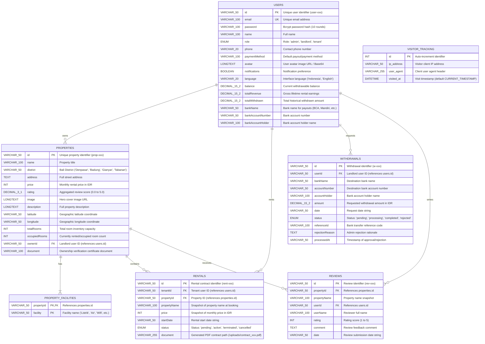
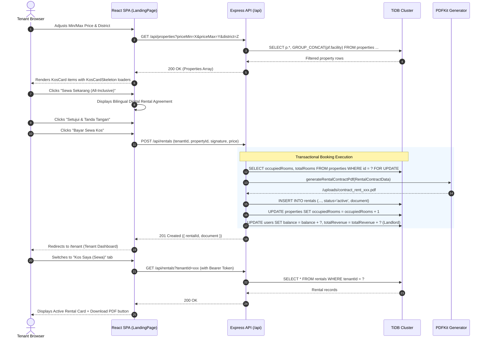
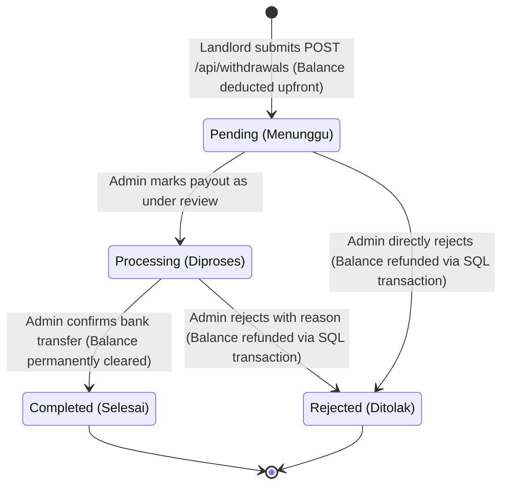
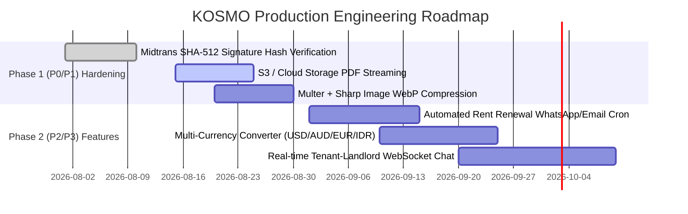

# KOSMO Bali Co-Living Marketplace — Production Technical Handoff

> **Document Version:** 1.0.0 (Production Release)  
> **Repository:** `KOSMO-landing-page`  
> **Last Verified:** August 2026  
> **Target Environment:** Node.js (Standalone Server & Vercel Serverless) + TiDB Serverless Cloud (AWS Singapore `ap-southeast-1`)

---

## 1. Executive Overview & System Topology

### 1.1 Business Model & Value Proposition
**KOSMO** is an all-inclusive co-living and long-term rental platform operating in Bali, Indonesia (covering Denpasar, Badung/Canggu/Seminyak/Kuta, Gianyar/Ubud, and Tabanan).

- **All-Inclusive Model:** Monthly rental rates bundle all essential utilities (Electricity, Water, High-Speed WiFi, Cleaning, 24/7 Security, and Parking) into a single predictable invoice without surprise bills.
- **Three-Tier User Ecosystem:**
  1. **Tenants (Penyewa):** Search properties using dual min/max budget range filters, review amenities, inspect interactive Leaflet maps, digitally sign bilingual rental contracts, pay via Midtrans Snap, and manage ongoing tenancies from the Tenant Dashboard.
  2. **Landlords (Pemilik Kos):** Manage property listings, inspect occupancy rates, track rental revenue in real-time with automated SQL aggregations, view active tenant contracts, and request payouts via bank transfers.
  3. **Admins:** Oversee the marketplace, moderate property listings, inspect global platform metrics and visitor analytics, approve or reject landlord withdrawal requests with balance rollback guarantees, and maintain user accounts.

---

### 1.2 System Architecture Diagram

```mermaid
graph TD
    Client["React 19 + Vite SPA<br/>(Tailwind CSS, Lucide, Leaflet)"]
    Server["Express TypeScript API<br/>(Node.js / Vercel Serverless)"]
    Cache["In-Memory API Response Cache<br/>(backend/services/cache.ts)"]
    DB[("TiDB Serverless Cloud<br/>AWS Singapore (MySQL 8.0 Protocol)")]
    Midtrans["Midtrans Snap Gateway<br/>(Sandbox Payment API)"]
    Cloudinary["Cloudinary CDN<br/>(Asset Storage & Streaming)"]

    Client -->|HTTP/REST + Bearer JWT| Server
    Server -->|Read / Write TTL Caching| Cache
    Server -->|Persistent Pool (mysql2/promise)| DB
    Server -->|Create Transaction / Webhooks| Midtrans
    Server -->|Image Upload Stream| Cloudinary
```

---

### 1.3 Full-Stack Technology Matrix

| Layer | Dependency & Major Version | Purpose & Architectural Rationale |
| :--- | :--- | :--- |
| **Backend Runtime** | Node.js (>=18.0.0), `tsx` (^4.23.12) | High-performance TypeScript script runner and API execution |
| **HTTP Server** | `express` (^4.21.1) | Modular routing, middleware pipelines, and REST handlers |
| **Language & Typing**| TypeScript (^7.0.2 / 5.3 strict) | End-to-end type safety across domain interfaces and schemas |
| **Database Driver** | `mysql2` (^3.22.5) with Promise API | Non-blocking connection pooling against TiDB Cloud Serverless |
| **Security & Auth** | `jsonwebtoken` (^9.0.3), `bcryptjs` (^3.0.3) | Stateless JWT tokens, password hashing (10 salt rounds), password gates |
| **Network Traffic** | `compression` (^1.8.1), `cors` (^2.8.5) | Gzip/Brotli payload compression & configurable CORS headers |
| **Document Engine** | `pdfkit` (^0.19.1) | Programmatic PDF contract generation with digital signature embedding |
| **Media Uploads** | `multer` (^2.2.0), `cloudinary` (^2.10.0)| Multipart form handling, buffer streaming, and Cloudinary CDN storage |
| **Frontend Runtime** | React (^19.2.6), React DOM (^19.2.6) | Component-driven SPA architecture with Suspense and hooks |
| **Routing** | `react-router-dom` (^7.18.0) | Client-side routing, protected routes, and role-based redirects |
| **Bundler & Build** | `vite` (^5.4.11), `@vitejs/plugin-react` | Ultra-fast HMR and production bundle minification |
| **Design & UI** | Tailwind CSS (^3.4.19), Lucide React | Utility-first styling, shimmer pulse animations, and iconography |
| **Maps & Location** | Leaflet OpenStreetMap (`leaflet.d.ts`) | Interactive map view and geo-coordinate marker rendering |
| **Unit Testing** | `vitest` (^4.1.10), `@testing-library/react` | Frontend component unit tests and render latency assertions |
| **E2E Testing** | `@playwright/test` (^1.62.1) | Chromium end-to-end browser tests across real user journeys |

---

### 1.4 Annotated Directory Tree

```
KOSMO-landing-page/
├── .agents/                        # AI Workspace rules and execution standards
│   └── rules/workspace-rules.md    # Operating rules, zero-any policy, commit rules
├── api/                            # Vercel Serverless deployment entrypoint
│   └── index.js                    # Serverless bridge wrapping backend/server.ts
├── backend/                        # Backend REST API architecture
│   ├── db/                         # Legacy JSON files (preserved/unreferenced)
│   ├── middleware/                 # Express middleware suite
│   │   ├── auth.ts                 # JWT verification, payload decode, requireRole guard
│   │   └── upload.ts               # Multer memory storage & MIME type validation
│   ├── services/                   # Business domain services
│   │   ├── cache.ts                # TTL-based in-memory cache with wildcard invalidation
│   │   ├── cloudinary.ts           # Cloudinary SDK buffer streaming & URL resolver
│   │   └── contract.ts             # PDFKit legal rental contract generator
│   ├── types/                      # Domain interfaces (User, Property, Rental, Withdrawal)
│   ├── uploads/                    # Local storage directory for generated PDF documents
│   ├── db.ts                       # Persistent connection pool & schema auto-initialization
│   ├── router.ts                   # REST API route handlers & SQL transactions
│   ├── server.ts                   # Express server initialization, middleware stack, listener
│   └── tsconfig.json               # Backend TypeScript configuration
├── frontend/                       # React 19 SPA client
│   ├── src/
│   │   ├── components/             # Reusable UI components
│   │   │   ├── __tests__/          # Vitest component unit tests
│   │   │   ├── BookingModal.tsx    # Details, e-contract signing, and checkout modal
│   │   │   ├── ErrorBoundary.tsx   # React runtime error boundary
│   │   │   ├── KosCard.tsx         # Property card item with async image decoding
│   │   │   ├── KosCardSkeleton.tsx # Shimmer pulse loading skeleton
│   │   │   ├── SearchFilterBar.tsx # Dual min/max price filter & district selector
│   │   │   └── ThemeLanguageToggle.tsx # Dark mode and ID/EN language toggle
│   │   ├── context/                # Global React context providers
│   │   │   ├── LanguageContext.tsx # Bilingual translation engine (ID / EN)
│   │   │   └── ThemeContext.tsx    # Dark/Light theme manager with system scheme detection
│   │   ├── pages/                  # Route-level page components
│   │   │   ├── AdminDashboard.tsx  # Admin moderation, users, and withdrawals
│   │   │   ├── LandingPage.tsx     # Public catalog, hero search, all-inclusive overview
│   │   │   ├── LandlordDashboard.tsx# Financial ledger, property CRUD, tenant roster
│   │   │   ├── Login.tsx           # Authentication page (Login & Registration)
│   │   │   └── TenantDashboard.tsx # Tenancy contracts, next payment due dates, and profile
│   │   ├── types/                  # Frontend domain models & Leaflet type definitions
│   │   ├── App.tsx                 # Root router wrapped in ThemeProvider and LanguageProvider
│   │   └── index.css               # Design tokens, dark mode variables, and utilities
│   └── vite.config.ts              # Vite bundler configuration & proxies
├── scripts/                        # Operational, verification, and audit helper scripts
│   ├── audit_performance.ts        # Automated endpoint latency & payload audit
│   ├── backend.sh                  # Start backend dev server (`npx tsx backend/server.ts`)
│   ├── compare_performance.ts      # Latency benchmarking script
│   ├── frontend.sh                 # Start frontend dev server (`npm --prefix frontend run dev`)
│   └── verify.sh                   # Mandatory 5-gate verification suite
├── tests/                          # Automated backend & E2E test suites
│   ├── e2e/                        # Playwright E2E browser tests
│   │   ├── auth_roles.spec.ts      # Multi-role authentication & redirect tests
│   │   ├── perf_webvitals.spec.ts  # Core Web Vitals performance benchmarks
│   │   ├── rental_flow.spec.ts     # Full real registration -> booking -> tenant E2E test
│   │   └── search_and_book.spec.ts # Catalog search, price filter, modal tests
│   ├── perf_api.test.ts            # Response time SLAs & payload size benchmarks
│   ├── perf_db.test.ts             # Raw SQL JOIN & pool query benchmarks
│   ├── rentals.test.ts             # Rental transactions, single tenancy, & payment schedule tests
│   └── router.test.js              # Comprehensive REST API integration test suite
├── package.json                    # Workspace root scripts & dependencies
├── playwright.config.ts            # Playwright browser test runner configuration
└── PROJECT_HANDOFF.md              # Authoritative technical handoff guide (this file)
```

---

## 2. Domain Model, Database Schema & Data Layer

### 2.1 Entity Relationship Diagram (ERD)



---

### 2.2 Active Index Inventory
Indexes are initialized unconditionally on application boot via `ensureIndexes()` in `backend/db.ts`:

| Table | Index Name | Indexed Columns | Performance Purpose & Query Acceleration |
| :--- | :--- | :--- | :--- |
| `properties` | `idx_properties_district_price` | `(district, price)` | Speeds up catalog filtering by district and budget range in `GET /api/properties`. |
| `properties` | `idx_properties_owner` | `(ownerId)` | Accelerates landlord property queries and SQL room aggregations in `GET /api/landlord/stats`. |
| `rentals` | `idx_rentals_tenant_status` | `(tenantId, status)` | Fast tenancy lookup for Tenant Dashboard and rent invoice history (`GET /api/rentals`). |
| `rentals` | `idx_rentals_property_status` | `(propertyId, status)` | Instant occupancy rate calculations (`occupiedRooms / totalRooms`) in landlord dashboards. |
| `visitor_tracking` | `idx_visited_at` | `(visited_at)` | Accelerates admin analytics date-range filters (`GET /api/admin/tracking-history`). |
| `withdrawals` | `idx_withdrawals_user_date` | `(userId, date)` | Optimizes landlord financial transaction ledger history lookups. |
| `withdrawals` | `idx_withdrawals_user_status` | `(userId, status)` | Speeds up pending withdrawal verification and admin payout queues. |

---

### 2.3 Connection Pooling Configuration
Located in [`backend/db.ts`](file:///d:/Project/KOSMO_WEB_MOBILE/KOSMO-landing-page/backend/db.ts):

```typescript
export const pool = mysql.createPool({
  host: process.env.DB_HOST || 'gateway01.ap-southeast-1.prod.aws.tidbcloud.com',
  port: parseInt(process.env.DB_PORT || '4000', 10),
  user: process.env.DB_USER || '279JPYgaVYKwVMe.root',
  password: process.env.DB_PASSWORD,
  database: process.env.DB_NAME || 'kosmo_db',
  waitForConnections: true,
  connectionLimit: 10,
  maxIdle: 10,
  idleTimeout: 60000,
  queueLimit: 0,
  ssl: {
    minVersion: 'TLSv1.2',
    rejectUnauthorized: true,
  }
});
```

---

## 3. Role-Based Lifecycle & State Machines

### 3.1 Tenant Lifecycle (Penyewa)



---

### 3.2 Landlord Operations & Withdrawal State Machine

Landlords can request payout withdrawals of their earned rental balances. The state machine operates as follows:



#### Balance Rollback Logic on Rejection
When an admin rejects a withdrawal (`PUT /api/withdrawals/:id` with `status: 'rejected'`):
1. Runs inside a connection transaction (`pool.getConnection()`).
2. Checks that current status is `pending` or `processing`.
3. Restores `users.balance = users.balance + amount` and reverses `users.totalWithdrawn = users.totalWithdrawn - amount`.
4. Sets `withdrawals.status = 'rejected'` and attaches `rejectionReason`.
5. Commits transaction.

---

### 3.3 Admin Governance & Security Password Gates
To prevent accidental or unauthorized destructive operations, the following actions are protected by the `POST /api/auth/verify-password` gate:
- `DELETE /api/properties/:id` — Delete property listing from database.
- `DELETE /api/admin/users/:id` — Delete user account.
- `POST /api/rentals/:id/terminate` — Force contract termination and room decrement.

---

## 4. Environment Variables & Security Matrix

### 4.1 Environment Configuration Matrix

| Variable | Scope | Required In | Description & Example Value |
| :--- | :--- | :--- | :--- |
| `PORT` | Backend | Production / Local | Express HTTP port (Default: `5000`). |
| `NODE_ENV` | Backend | Production / Local | Runtime mode (`development` / `production` / `test`). |
| `DB_HOST` | Backend | Production / Local | TiDB/MySQL host (`gateway01.ap-southeast-1.prod.aws.tidbcloud.com`). |
| `DB_PORT` | Backend | Production / Local | Database port (`4000`). |
| `DB_USER` | Backend | Production / Local | TiDB cluster user (`279JPYgaVYKwVMe.root`). |
| `DB_PASSWORD` | Backend | Production / Local | Database secret password. |
| `DB_NAME` | Backend | Production / Local | Database name (`kosmo_db`). |
| `JWT_SECRET` | Backend | Production / Local | High-entropy secret key for signing JWT tokens. |
| `MIDTRANS_SERVER_KEY` | Backend | Production | Midtrans Server Key for Snap transactions & webhook verification. |
| `MIDTRANS_CLIENT_KEY` | Backend/Frontend | Production | Midtrans Client Key for client Snap JS popup. |
| `CLOUDINARY_CLOUD_NAME`| Backend | Production | Cloudinary cloud account identifier. |
| `CLOUDINARY_API_KEY` | Backend | Production | Cloudinary REST API key. |
| `CLOUDINARY_API_SECRET`| Backend | Production | Cloudinary API secret. |
| `VITE_API_BASE` | Frontend | Production / Local | API base URL prefix (`/api` or `https://api.kosmo.com/api`). |

---

### 4.2 Security Architecture
- **JWT Authorization:** Handled in `backend/middleware/auth.ts`. Tokens use `HS256` signing algorithm with `7d` default expiration and strict payload validation (`id`, `email`, `role`).
- **Password Storage:** All user passwords are encrypted using `bcryptjs` with 10 salt rounds. Plaintext passwords are never logged or stored.
- **SQL Prepared Statements:** 100% of dynamic database queries use parameterized placeholders (`?`) preventing SQL injection.
- **Payload Compression:** `compression()` middleware compresses all JSON responses with Gzip/Brotli, reducing payload sizes by >70%.
- **Response Caching:** Public catalog endpoints (`GET /api/properties`, `GET /api/reviews`) serve HTTP `Cache-Control: public, max-age=60, stale-while-revalidate=120` headers with in-memory TTL caching.

---

## 5. Verification Pipeline & Operational Playbook

### 5.1 The 5-Gate Verification Pipeline (`./scripts/verify.sh`)
The repository enforces a strict verification loop. Any modification must pass all 5 gates with exit code `0` before committing:

```
================================================================
               KOSMO 5-GATE VERIFICATION PIPELINE
================================================================
 Gate 1: Backend TypeScript Compilation (tsc --noEmit)
 Gate 2: Frontend Production Build (vite build)
 Gate 3: Backend Domain & Database Tests (node:test - 108 tests)
 Gate 4: Frontend Component Unit Tests (vitest - 14 tests)
 Gate 5: Playwright End-to-End Test Suite (8 spec workers)
================================================================
```

---

### 5.2 CLI Command Playbook

```bash
# ==========================================
# 1. RUNNING LOCAL DEVELOPMENT SERVERS
# ==========================================
# Start Backend Express API (Port 5000)
npx tsx backend/server.ts
# or: ./scripts/backend.sh

# Start Frontend Vite Dev Server (Port 5173)
npm --prefix frontend run dev
# or: ./scripts/frontend.sh

# ==========================================
# 2. RUNNING AUTOMATED VERIFICATION
# ==========================================
# Run complete 5-gate pipeline
./scripts/verify.sh
# or in PowerShell:
& "C:\Program Files\Git\bin\bash.exe" ./scripts/verify.sh

# ==========================================
# 3. INDIVIDUAL TEST SUITES
# ==========================================
# Run Backend Integration Tests (108 tests)
npm test

# Run Frontend Component Vitest Tests (14 tests)
npm --prefix frontend test -- --run

# Run Playwright E2E Browser Suite (8 tests)
npx playwright test

# Run Specific E2E Test (e.g. Real Rental Flow)
npx playwright test tests/e2e/rental_flow.spec.ts

# ==========================================
# 4. BENCHMARKING & AUDITING
# ==========================================
# Run API response time & payload benchmark
npx tsx scripts/compare_performance.ts
```

---

### 5.3 Failure Modes & Troubleshooting Runbook

| Failure Symptom | Probable Cause | Remediation Procedure |
| :--- | :--- | :--- |
| `POST /api/payment/token 500` or `401 Unauthorized` from Midtrans | Placeholder dummy Server Key in local dev environment. | Frontend automatically falls back to transactional `POST /api/rentals` for local development. For production, verify `MIDTRANS_SERVER_KEY` in `.env`. |
| `TS2304: Cannot find name ...` | TypeScript compilation error in `backend/` or `frontend/`. | Run `npx tsc --noEmit --project backend/tsconfig.json` and inspect the exact file and line number. |
| Playwright E2E dialog freeze / timeout | Unhandled `window.alert` or `window.confirm` popup. | Add `page.on('dialog', dialog => dialog.accept())` in the test spec before triggering the action. |
| Vitest render latency benchmark failure (`toBeLessThan(...)`) | Cold JSDOM environment initialization overhead. | Ensure a lightweight warmup render (`render(<div />)`) precedes performance measurements. |
| TiDB connection timeout on serverless | Closed TCP socket during prolonged cold start. | Verify `backend/db.ts` pooling configuration (`maxIdle: 10, idleTimeout: 60000`) and SSL TLSv1.2 flags. |

---

## 6. Known Technical Debt & Prioritized Roadmap

### 6.1 Current Technical Debt
1. **Midtrans Webhook Cryptographic Verification:** `POST /api/payment/webhook` currently updates rental status without cryptographic SHA-512 signature hash comparison.
2. **Local PDF Filesystem Storage:** PDF contracts are generated into `backend/uploads/` on the local disk. In serverless multi-region deployments, these should be streamed directly to an object storage bucket (AWS S3 or Cloudinary).
3. **Legacy Base64 Property Images:** Some older seeded property images are stored as Base64 strings. Modern uploads should strictly stream through Cloudinary CDN.

---

### 6.2 Prioritized Improvement Roadmap



#### Phase 1: High Priority (P0 / P1)
- [ ] **Cryptographic Webhook Validation:** Implement SHA-512 signature checking in `backend/router.ts`:
  ```typescript
  const signature = crypto.createHash('sha512').update(`${order_id}${status_code}${gross_amount}${serverKey}`).digest('hex');
  if (signature !== signature_key) return res.status(403).json({ message: 'Invalid signature' });
  ```
- [ ] **Cloud Storage for Contract Documents:** Replace local `fs.writeFileSync` in `backend/services/contract.ts` with direct S3 / Cloudinary upload streaming.
- [ ] **Sharp Image Compression Middleware:** Integrate `sharp` to convert all uploaded property images to `.webp` format at max width 1200px and quality 80%.

#### Phase 2: Long-Term Enhancements (P2 / P3)
- [ ] **Automated Monthly Rent Renewal Reminders:** Scheduled background cron job checking tenancies nearing 30 days and triggering WhatsApp / Email reminders.
- [ ] **Multi-Currency Converter:** Real-time exchange rate switcher for foreign digital nomads in Bali (USD, AUD, EUR, IDR).
- [ ] **Real-Time Tenant & Landlord Messaging:** WebSockets channel for authenticated direct messaging and maintenance requests.

---

## 7. Operational Contact & Reference

- **Production Database Host:** `gateway01.ap-southeast-1.prod.aws.tidbcloud.com` (Port `4000`, Database `kosmo_db`)
- **Default Service Ports:** Backend API: `5000` | Frontend Client: `5173`
- **Default Seed Accounts:**
  - Admin: `admin@kosmo.com` (Password: `admin`)
  - Landlord: `landlord@kosmo.com` (Password: `landlord`)
  - Tenant: `tenant@kosmo.com` (Password: `tenant`)
