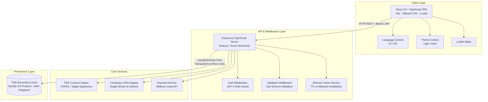
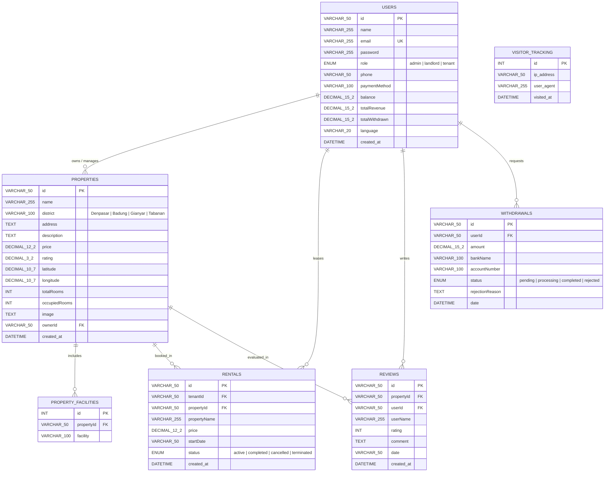

# KOSMO — Bali Co-Living & Long-Term Rental Marketplace

<div align="center">

[](https://nodejs.org/)
[](https://www.typescriptlang.org/)
[](https://react.dev/)
[](https://expressjs.com/)
[](https://www.pingcap.com/tidb-cloud/)
[](https://tailwindcss.com/)
[](https://vitejs.dev/)
[](https://playwright.dev/)
[](https://vitest.dev/)

<p align="center">
  <strong>An all-inclusive, digital-first co-living marketplace built for Bali, Indonesia.</strong><br/>
  Seamless search, bilingual digital lease agreements, Midtrans Snap payments, live financial ledgers, and end-to-end platform governance.
</p>

[Key Features](#-key-features) • [System Architecture](#-system-architecture) • [Tech Stack](#-technology-stack) • [Quickstart Guide](#-quickstart-guide) • [API Documentation](#-api-reference) • [Verification & Testing](#-testing--quality-assurance) • [Deployment](#-deployment)

---

</div>

## 📌 Executive Summary

**KOSMO** is a modern co-living and rental ecosystem engineered for Bali's thriving resident, expatriate, and digital nomad communities across **Denpasar**, **Badung** (Canggu, Seminyak, Kuta), **Gianyar** (Ubud), and **Tabanan**.

Unlike conventional classifieds, KOSMO operates on a transparent, **all-inclusive model**:
- ⚡ **Zero Hidden Utility Fees:** Monthly rates bundle PLN electricity token, filtered PDAM/deep-well water, and high-speed dedicated 100 Mbps fiber internet.
- 🧹 **Hospitality Services:** Bi-weekly professional housekeeping, regular linen change, and trash disposal included.
- 🔒 **Security & Convenience:** 24/7 smart lock keyless access, on-site security, and designated motorbike/car parking.
- 📜 **Legally Binding Digital Contracts:** Interactive bilingual (ID/EN) digital agreements with embedded canvas signatures and dynamic PDF generation.
- 💳 **Integrated Cashless Settlement:** Real-time escrow-like checkout powered by the Midtrans Snap payment gateway with SHA-512 cryptographic webhook verification.

---

## 🌟 Key Features

### 🏠 Tenant Experience (`/tenant`)
- **Dual Min/Max Budget Filtering:** Real-time range filtering (`priceMin` & `priceMax`) with instant out-of-bounds short-circuiting.
- **Interactive Geospatial Exploration:** Integrated Leaflet OpenStreetMap view rendering verified Bali coordinates and property cards.
- **Bilingual Digital Contract (E-Sign):** Canvas signature pad generating legally valid, tamper-proof lease agreements.
- **Dynamic PDF Lease Generator:** Programmatic PDF contract generation with embedded digital signature, downloadable anytime from the dashboard.
- **Cashless Midtrans Snap Checkout:** Instant payment processing supporting Indonesian Virtual Accounts (BCA, Mandiri, BNI, BRI), QRIS, GoPay, and Credit Cards.
- **Single Active Tenancy Guard:** Concurrency rule preventing overlapping active leases to protect both tenants and property inventory.
- **Next Payment & Due Date Engine:** Automatic calculation of monthly lease anniversary cycles, days remaining, and proactive due date badges.
- **Secure Lease Termination Gate:** Password-verified workflow with atomic occupancy release.

### 🏢 Landlord Operations (`/landlord`)
- **Real-Time Property Portfolio CRUD:** Multi-photo uploads streamed to Cloudinary CDN with automatic responsive URL generation.
- **Occupancy Rate Tracking:** Dynamic calculations (`occupiedRooms / totalRooms`) with live occupancy indicators.
- **SQL-Aggregated Financial Ledger:** Real-time monthly revenue and transaction aggregations calculated directly in the database.
- **Active Tenant Roster:** View active leaseholders, contact channels (WhatsApp/Phone), and contract start dates.
- **Atomic Balance & Withdrawal Engine:** Dedicated payout requests with upfront balance deduction, row-level locking (`SELECT ... FOR UPDATE`), and atomic refund rollbacks on admin rejection.

### 🛡️ Platform Administration & Governance (`/admin`)
- **Marketplace Metrics Overview:** Gross transaction volume (GMV), total active listings, overall occupancy rate, and user distribution.
- **Visitor Traffic & Analytics:** Real-time IP and User-Agent tracking with 24h, 7d, and 30d visual historical traffic charts.
- **Financial Payout Approval Pipeline:** Review pending withdrawal requests, complete payouts, or reject with reason and automatic fund reversal.
- **Excel Ledger Export:** Generate and stream `.xlsx` financial and traffic audit reports via `xlsx`.
- **Property & User Moderation:** High-privilege management guarded by re-authentication gates.

### 🌐 Cross-Cutting System Capabilities
- **Bilingual Internationalization (i18n):** Native support for **Bahasa Indonesia (`id`)** and **English (`en`)**, persisted in `localStorage` and synchronized with user profiles.
- **Adaptive Theme System:** Dark and Light mode toggling with `prefers-color-scheme` auto-detection and zero Cumulative Layout Shift (CLS).
- **Mobile-First Responsive Layouts:** Optimized for all viewports with touch-friendly targets (minimum $44 \times 44\text{ px}$).

---

## 🏗️ System Architecture



---

## 💻 Technology Stack

| Domain | Technology / Library | Version | Role in Architecture |
| :--- | :--- | :--- | :--- |
| **Frontend Framework** | [React](https://react.dev/) | `^19.2.6` | Concurrent component rendering, hooks, and Suspense |
| **Frontend Routing** | [React Router DOM](https://reactrouter.com/) | `^7.18.0` | Client-side routing, protected routes, role redirects |
| **Styling & Icons** | [Tailwind CSS](https://tailwindcss.com/) / [Lucide](https://lucide.dev/) | `^3.4.19` / `^1.21.0` | Design token system, dark mode (`class`), iconography |
| **Map Rendering** | [Leaflet](https://leafletjs.com/) | `^1.9.4` | Interactive OpenStreetMap coordinate mapping |
| **Backend Runtime** | [Node.js](https://nodejs.org/) & [tsx](https://github.com/privatenumber/tsx) | `>=18.0.0` / `^4.23.12` | High-performance TypeScript execution engine |
| **Server Framework** | [Express](https://expressjs.com/) | `^4.21.1` | REST API routing, rate limiting, and middleware stack |
| **Type System** | [TypeScript](https://www.typescriptlang.org/) | `^5.3.3` | End-to-end type safety, domain contracts, zero `any` policy |
| **Database & Driver**| [TiDB Cloud](https://www.pingcap.com/tidb-cloud/) & [mysql2](https://github.com/sidorares/node-mysql2) | `^3.22.5` | Cloud relational database with connection pooling & SSL |
| **Data Validation** | [Zod](https://zod.dev/) | `^4.4.3` | Schema definition and strict runtime request validation |
| **Authentication** | [jsonwebtoken](https://github.com/auth0/node-jsonwebtoken) / [bcryptjs](https://github.com/dcodeIO/bcrypt.js) | `^9.0.3` / `^3.0.3` | Stateless Bearer JWT tokens & salted password hashing |
| **Payment Gateway** | [Midtrans Node Client](https://github.com/veritrans/midtrans-nodejs-client) | `^1.4.3` | Snap token generation & SHA-512 webhook verification |
| **Asset CDN** | [Cloudinary](https://cloudinary.com/) & [Multer](https://github.com/expressjs/multer) | `^2.10.0` / `^2.2.0` | Multi-part memory uploads & CDN media distribution |
| **Document Engine** | [PDFKit](https://pdfkit.org/) | `^0.19.1` | Programmatic PDF contract generation with signatures |
| **Spreadsheets** | [xlsx (SheetJS)](https://sheetjs.com/) | `^0.18.5` | Automated Excel financial and visitor report generation |
| **Unit Testing** | [Node Native Test](https://nodejs.org/api/test.html) & [Vitest](https://vitest.dev/) | `Node 20+` / `^4.1.10` | Backend domain unit tests & React component tests |
| **E2E Testing** | [Playwright](https://playwright.dev/) | `^1.62.1` | Real browser end-to-end integration tests |

---

## 🗄️ Database Schema & Relational Models



### ⚡ Optimized Database Indexes
Initialized dynamically on server boot via `backend/db.ts`:
- `properties (district, price)` — Accelerates public catalog filter queries.
- `properties (ownerId)` — Accelerates landlord property and occupancy aggregations.
- `rentals (tenantId, status)` — Accelerates single tenancy verification and tenant dashboard queries.
- `rentals (propertyId, status)` — Accelerates landlord occupancy calculation.
- `withdrawals (userId, date)` — Optimizes transaction ledger queries.
- `withdrawals (userId, status)` — Accelerates pending withdrawal lookups.
- `visitor_tracking (visited_at)` — Accelerates admin traffic date-range filtering.

---

## 🚀 Quickstart Guide

### 1. Prerequisites
- **Node.js:** `>= 18.0.0` (LTS recommended, e.g. Node 20+)
- **npm:** `>= 9.0.0`
- **Database:** MySQL 8.0+ or a [TiDB Serverless](https://www.pingcap.com/tidb-cloud/) cluster

### 2. Installation
```bash
# Clone the repository
git clone https://github.com/Dramaniako/KOSMO-landing-page.git
cd KOSMO-landing-page

# Install root & workspace dependencies
npm install
```

### 3. Environment Configuration
Create a `.env` file in the root directory (refer to [`.env.example`](file:///.env.example)):

```env
# Server Environment
PORT=5000
NODE_ENV=development

# TiDB Cloud / MySQL Connection
DB_HOST=gateway01.ap-southeast-1.prod.aws.tidbcloud.com
DB_PORT=4000
DB_USER=your_db_user.root
DB_PASSWORD=your_db_password
DB_NAME=kosmo_db
DB_SSL=true

# Midtrans Payment Gateway
MIDTRANS_SERVER_KEY=SB-Mid-server-your-server-key
MIDTRANS_CLIENT_KEY=SB-Mid-client-your-client-key
MIDTRANS_IS_PRODUCTION=false

# Cloudinary Media CDN
CLOUDINARY_CLOUD_NAME=your_cloud_name
CLOUDINARY_API_KEY=your_api_key
CLOUDINARY_API_SECRET=your_api_secret

# JWT Authentication
JWT_SECRET=super-secret-jwt-key-with-high-entropy-minimum-32-chars
```

### 4. Database Setup & Seeding
```bash
# Run schema migration & seed curated Bali properties, reviews, and test accounts
npm run db:seed
```

### 5. Running the Application
Open two terminals or run concurrently:

```bash
# Terminal 1: Start Backend API (runs on http://localhost:5000)
npm run dev:backend

# Terminal 2: Start Frontend Client (runs on http://localhost:5173)
npm --prefix frontend run dev
```

### 🔑 Demo Accounts (Pre-Seeded)

| Role | Email | Password | Primary Dashboard |
| :--- | :--- | :--- | :--- |
| **Administrator** | `admin@kosmo.com` | `admin` | [`/admin`](http://localhost:5173/admin) |
| **Landlord (Pemilik)** | `landlord@kosmo.com` | `landlord` | [`/landlord`](http://localhost:5173/landlord) |
| **Tenant (Penyewa)** | `tenant@kosmo.com` | `tenant` | [`/tenant`](http://localhost:5173/tenant) |

---

## 📡 API Reference

All REST endpoints are prefixed with `/api` and return JSON payloads. Protected routes require `Authorization: Bearer <token>`.

### Authentication & Users
| Method | Endpoint | Access | Description |
| :--- | :--- | :--- | :--- |
| `POST` | `/api/auth/login` | Public | Authenticates credentials and issues signed 7d JWT token |
| `POST` | `/api/auth/register` | Public | Registers a new tenant or landlord user account |
| `POST` | `/api/auth/verify-password` | Protected | Password confirmation gate for destructive actions |
| `GET` | `/api/users/profile/:id` | Protected | Retrieves user profile data |
| `PUT` | `/api/users/profile/:id` | Protected | Updates user contact and banking details |
| `PUT` | `/api/auth/profile` | Protected | Updates user preferences (language, notification) |

### Properties & Listings
| Method | Endpoint | Access | Description |
| :--- | :--- | :--- | :--- |
| `GET` | `/api/properties` | Public | Lists properties with `district`, `priceMin`, and `priceMax` filters |
| `GET` | `/api/properties/:id` | Public | Retrieves detailed property profile and facilities |
| `POST` | `/api/properties` | Landlord / Admin | Creates a new property listing with facilities |
| `PUT` | `/api/properties/:id` | Landlord / Admin | Updates property details, price, or room counts |
| `DELETE` | `/api/properties/:id` | Landlord / Admin | Deletes property (requires password verification) |

### Rentals & Lease Management
| Method | Endpoint | Access | Description |
| :--- | :--- | :--- | :--- |
| `GET` | `/api/tenant/rentals` | Tenant | Retrieves active lease, payment due countdown, and rental history |
| `POST` | `/api/rentals` | Tenant | Creates a new rental agreement with digital signature |
| `POST` | `/api/rentals/:id/terminate` | Tenant / Admin | Terminates rental and decrements room occupancy |
| `GET` | `/api/rentals/:id/contract` | Protected | Generates and streams PDF lease agreement with signature |

### Payments (Midtrans Snap)
| Method | Endpoint | Access | Description |
| :--- | :--- | :--- | :--- |
| `POST` | `/api/payment/token` | Tenant | Checks active lease rule and creates Midtrans Snap transaction token |
| `POST` | `/api/payment/webhook` | Public (Signed) | Handles asynchronous Midtrans payment notifications with SHA-512 validation |

### Landlord Operations & Withdrawals
| Method | Endpoint | Access | Description |
| :--- | :--- | :--- | :--- |
| `GET` | `/api/landlord/stats` | Landlord | Computes occupancy rate, room capacity, and active leases |
| `GET` | `/api/landlord/financials`| Landlord | Aggregates monthly revenue metrics and transaction counts |
| `GET` | `/api/landlord/rentals` | Landlord | Retrieves tenant roster for properties owned by landlord |
| `POST` | `/api/withdraw` | Landlord | Submits payout request with upfront transactional deduction |
| `GET` | `/api/withdrawals/me` | Landlord | Retrieves landlord withdrawal history |

### Admin Governance & Reports
| Method | Endpoint | Access | Description |
| :--- | :--- | :--- | :--- |
| `GET` | `/api/admin/stats` | Admin | Computes global marketplace analytics & revenue totals |
| `GET` | `/api/admin/withdrawals` | Admin | Retrieves pending and processed payout requests |
| `POST` | `/api/admin/withdrawals/:id/process` | Admin | Approves payout and marks as completed |
| `POST` | `/api/admin/withdrawals/:id/reject` | Admin | Rejects payout and atomically rolls back landlord balance |
| `GET` | `/api/admin/tracking-history`| Admin | Returns historical visitor traffic grouped by hour/day |
| `GET` | `/api/reports/tracking/excel` | Admin | Generates and streams `.xlsx` visitor audit report |
| `GET` | `/api/reports/landlord/excel` | Landlord / Admin | Generates and streams `.xlsx` landlord earnings ledger |

---

## 🔒 Security & Verification Standards

### 1. Midtrans Cryptographic Signature Matching
To safeguard payment webhooks against forgery, incoming payloads are validated using SHA-512 signature hashing:

$$\text{Signature} = \text{SHA-512}\left(\text{order\_id} + \text{status\_code} + \text{gross\_amount} + \text{MIDTRANS\_SERVER\_KEY}\right)$$

### 2. Transactional Concurrency & Balance Protection
- **Pessimistic Row-Level Locking:** Landlord balance mutations, withdrawal requests, and admin approvals/rejections use `SELECT ... FOR UPDATE` within database transactions.
- **Atomic Rollback Guarantee:** If an admin rejects a withdrawal request, the deducted balance is refunded atomically to the landlord's account with complete ledger integrity.

### 3. Password Verification Gates
Destructive operations (such as property deletion and premature tenancy cancellation) require explicit user password confirmation via `POST /api/auth/verify-password` before proceeding.

### 4. Prepared SQL Statements
100% of database interactions utilize parameterized prepared statements via `mysql2/promise` to eliminate SQL injection vulnerabilities.

---

## 🧪 Testing & Quality Assurance

KOSMO employs a deterministic **5-Gate Verification Pipeline** enforcing strict quality gates before any deployment:

```bash
# Run the complete automated verification pipeline
./scripts/verify.sh
```

### Individual Test Commands

```bash
# 1. Strict TypeScript Type Check (Zero-Any Policy)
npm run type-check

# 2. Backend Unit & Domain Test Suite (Node.js Native Runner)
npm test

# 3. Frontend Component Tests (Vitest & Testing Library)
npm --prefix frontend test -- --run

# 4. Live Database Integration & Concurrency Tests
npm run test:integration

# 5. End-to-End Browser Journeys (Playwright Chromium)
npm run test:e2e

# 6. Performance & SLA Latency Audits
npm run perf:audit
npm run perf:benchmark
```

---

## 📦 Deployment

### Option A: Standalone Node.js Server (Linux / Docker / VPS)
```bash
# Build frontend and compile backend
npm run build

# Start the production server
NODE_ENV=production PORT=5000 npm start
```

### Option B: Vercel Serverless Deployment
The repository is pre-configured for Vercel Serverless deployments:
- `backend/api.ts` is bundled via esbuild into a standalone ESM module at `api/index.js`.
- Routing is defined in `vercel.json` to route `/api/*` requests to the serverless function and static paths to the Vite SPA bundle.

```bash
# Build for Vercel
npm run build

# Deploy with Vercel CLI
vercel --prod
```

---

## 📂 Project Structure

```
KOSMO-landing-page/
├── .agents/                        # AI Workspace execution rules & standards
│   └── rules/workspace-rules.md    # Operating standards & safety guidelines
├── api/                            # Vercel Serverless entrypoint
│   └── index.js                    # Bundled backend production artifact
├── backend/                        # Backend REST API architecture
│   ├── middleware/                 # Auth, upload, and Zod validation middleware
│   │   ├── auth.ts                 # JWT verification & role authorization guards
│   │   ├── upload.ts               # Multer memory storage & MIME filters
│   │   └── validation.ts           # Zod schema validation middleware
│   ├── services/                   # Business domain services
│   │   ├── cache.ts                # In-memory TTL cache with wildcard invalidation
│   │   ├── cloudinary.ts           # Cloudinary image streaming adapter
│   │   └── contract.ts             # PDFKit legal lease agreement generator
│   ├── types/                      # Domain TypeScript interfaces
│   ├── uploads/                    # Local storage fallback for PDF documents
│   ├── api.ts                      # Serverless entrypoint source
│   ├── db.ts                       # TiDB / MySQL pool & schema auto-initialization
│   ├── router.ts                   # REST API route handlers & SQL transactions
│   ├── server.ts                   # Express server entrypoint & middleware pipeline
│   └── tsconfig.json               # Backend TypeScript configuration
├── frontend/                       # React 19 Client SPA
│   ├── src/
│   │   ├── components/             # Reusable UI components (Modals, Cards, Filters)
│   │   │   ├── __tests__/          # Vitest component unit tests
│   │   │   ├── BookingModal.tsx    # Details, e-signing, and checkout modal
│   │   │   ├── KosCard.tsx         # Property card with async image decoding
│   │   │   ├── KosCardSkeleton.tsx # Shimmer pulse skeleton loader
│   │   │   ├── SearchFilterBar.tsx # Dual min/max price & district filter bar
│   │   │   └── ThemeLanguageToggle.tsx # Dark mode & ID/EN language toggle
│   │   ├── context/                # React Context Providers
│   │   │   ├── LanguageContext.tsx # Bilingual dictionary (ID / EN)
│   │   │   └── ThemeContext.tsx    # Light/Dark mode state & system detector
│   │   ├── pages/                  # Route-level pages
│   │   │   ├── AdminDashboard.tsx  # Platform analytics, moderation & payouts
│   │   │   ├── LandingPage.tsx     # Hero catalog, search bar & co-living guide
│   │   │   ├── LandlordDashboard.tsx# Property CRUD, ledger & tenant roster
│   │   │   ├── Login.tsx           # Authentication portal (Login & Register)
│   │   │   └── TenantDashboard.tsx # Active lease, payment schedule & PDF contract
│   │   ├── types/                  # Frontend interfaces & Leaflet declarations
│   │   ├── App.tsx                 # Root router with Context Providers
│   │   └── index.css               # Design tokens, Tailwind directives & dark mode
│   └── vite.config.ts              # Vite bundler configuration & API proxy
├── scripts/                        # Operational & maintenance scripts
│   ├── audit_performance.ts        # Automated endpoint latency & payload audit
│   ├── benchmark_api.ts            # High-throughput API benchmarking
│   ├── check_property_occupancy.ts # Property occupancy auditor & repair tool
│   ├── diagnose_db.ts              # Database connection diagnostic tool
│   ├── seed.ts                     # Automated database reset & Bali data seeder
│   └── verify.sh                   # 5-Gate verification script
├── tests/                          # Automated test suites
│   ├── e2e/                        # Playwright E2E browser tests
│   │   ├── auth_roles.spec.ts      # Multi-role authentication & redirect tests
│   │   ├── perf_webvitals.spec.ts  # Core Web Vitals performance benchmarks
│   │   ├── rental_flow.spec.ts     # Real registration -> booking -> tenant journey
│   │   └── search_and_book.spec.ts # Catalog search, price filter & modal flows
│   ├── auth.test.ts                # Authentication & password hashing tests
│   ├── contract.test.ts            # PDF contract generator & e-signature tests
│   ├── db_integration.test.ts      # Database transaction & rollback tests
│   ├── jwt.test.ts                 # JWT signing & expiration tests
│   ├── payment.test.ts             # Midtrans webhook & SHA-512 signature tests
│   ├── perf_api.test.ts            # API SLA & latency benchmarks
│   ├── perf_db.test.ts             # Raw SQL JOIN & pool query benchmarks
│   ├── rentals.test.ts             # Rental transactions & schedule tests
│   ├── router.test.ts              # REST endpoint registration tests
│   ├── search.test.ts              # Search & multi-parameter filter logic tests
│   ├── types.test.ts               # Domain schema boundary tests
│   ├── upload.test.ts              # Cloudinary upload & MIME type tests
│   └── withdrawals.test.ts         # Landlord withdrawal state machine tests
├── package.json                    # Monorepo workspaces & root scripts
├── playwright.config.ts            # Playwright browser test configuration
├── PROJECT_HANDOFF.md              # In-depth technical handoff documentation
└── README.md                       # Main project documentation (this file)
```

---

## 🤝 Contributing & Engineering Standards

1. **Strict TypeScript Policy:** All code must pass `tsc --noEmit` with zero compiler warnings or `any` assertions.
2. **Deterministic Verification:** Before submitting a pull request or committing changes, ensure `./scripts/verify.sh` passes with exit code `0`.
3. **Atomic Commits:** Follow the [Conventional Commits](https://www.conventionalcommits.org/) standard (`feat(scope): ...`, `fix(scope): ...`, `test(scope): ...`).
4. **Security First:** Never commit `.env` files or API secrets. Always use prepared SQL queries and password verification gates.

---

## 📄 License

This project is licensed under the **MIT License**. See the [LICENSE](LICENSE) file for details.

---

<div align="center">
  <sub>Built with ❤️ for Bali's Co-Living Community by the KOSMO Engineering Team.</sub>
</div>
