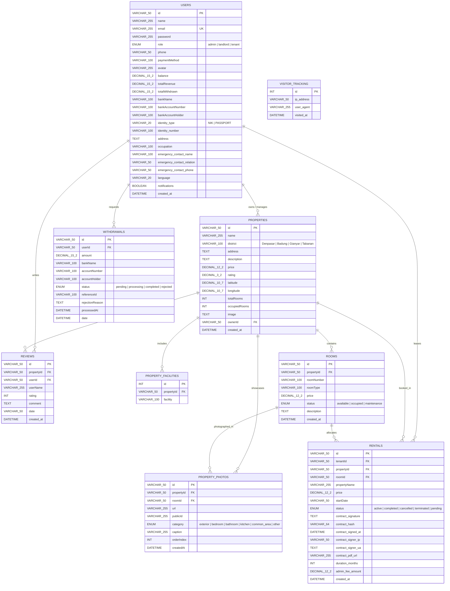

# KOSMO System Architecture & Database Design

This document details the architectural blueprints, technology stack decisions, database schema, and operational components of the **KOSMO** Bali Co-Living & Long-Term Rental Marketplace.

---

## 1. High-Level System Architecture

KOSMO follows a decoupled, modular client-server architecture designed to run on either a **standalone Node.js server** or a **serverless runtime (Vercel Serverless)** with external cloud persistence and asset streaming.

```mermaid
graph TD
    subgraph Client Layer (SPA)
        A[React 19 + TypeScript SPA<br/>Vite · Tailwind CSS · Lucide]
        A1[Language Context<br/>ID / EN]
        A2[Theme Context<br/>Light / Dark]
        A3[Leaflet OpenStreetMap]
        A4[Declarative ProtectedRoute Guard]
        A --> A1
        A --> A2
        A --> A3
        A --> A4
    end

    subgraph API & Middleware Stack (Express.js)
        B[Express.js TypeScript API<br/>Node.js / Vercel Serverless]
        B1[Auth Middleware<br/>JWT HS256 & Role Guard]
        B2[Validation Middleware<br/>Strict Zod Schema Validators]
        B3[Memory Cache Service<br/>TTL & Prefix-Based Invalidation]
        B4[Security Middleware<br/>Helmet, CORS, Rate Limiters]
        B --> B1
        B --> B2
        B --> B3
        B --> B4
    end

    subgraph External Cloud Services
        C1[PDF Contract Engine<br/>PDFKit + Digital Signatures]
        C2[Cloudinary CDN Adapter<br/>Direct Image Streaming & Delivery]
        C3[Payment Service<br/>Midtrans Snap API & Webhooks]
        B --> C1
        B --> C2
        B --> C3
    end

    subgraph Persistence Layer
        D[(TiDB Serverless Cloud<br/>MySQL 8.0 Protocol · AWS Singapore)]
        B -->|mysql2/promise Pool<br/>Transactions & Row Locks| D
    end

    A -->|HTTP REST + Bearer JWT| B
```

---

## 2. Core Architectural Principles

1. **Strict Type Safety & Zero-`any` Policy:**
   - Both backend and frontend codebases are strictly typed under TypeScript 5.3+ (`strict: true`).
   - Shared domain entities (User, Property, Room, Rental, Review, Withdrawal) maintain aligned schemas between server responses and React state models.

2. **Non-Blocking Asynchronous Runtime:**
   - All cryptographic routines (salted password hashing, verification) use asynchronous `bcrypt.hash()` and `bcrypt.compare()` to prevent Node.js event-loop starvation.
   - Long-lived operations (PDF contract generation, Cloudinary uploads, Excel streaming) are handled through memory buffers and streams without blocking disk I/O.

3. **Stateless Authentication with Dual Token Strategies:**
   - Standard session tokens: Signed HS256 JWT tokens with 7-day expiration sent via `Authorization: Bearer <token>` HTTP headers.
   - Short-lived file download tokens: 60-second single-purpose JWT tokens (`POST /api/reports/download-token`) to eliminate persistent credentials from URL query parameters.

4. **Transactional Data Integrity & Pessimistic Concurrency:**
   - All balance mutations, withdrawal lifecycles, and rental occupancy assignments execute inside isolated transactions (`pool.getConnection()`) using row-level locking (`SELECT ... FOR UPDATE`).
   - Automatic rollback and fund reversal guarantees prevent inventory leaks and financial discrepancies.

5. **Enterprise Error Handling & Fault Resilience:**
   - Centralized typed error hierarchy (`AppError`, `BadRequestError`, `ValidationError`, `ConflictError`, etc.) separating operational issues from programmer bugs.
   - RFC 7807 problem details specification compliant error envelopes with distributed request tracing (`X-Request-Id`).
   - Defense-in-depth against data leakage (CWE-209): production environments suppress stack traces and database internals.
   - Frontend self-healing with React `ErrorBoundary` supporting `resetKeys`, localized custom fallbacks, bilingual messaging, and global `ErrorContext` toasts.

---

## 3. Technology Stack Matrix

| Domain | Technology / Library | Version | Role in Architecture |
| :--- | :--- | :--- | :--- |
| **Frontend Framework** | [React](https://react.dev/) | `^19.2.6` | Concurrent component rendering, hooks, and Suspense |
| **Frontend Routing** | [React Router DOM](https://reactrouter.com/) | `^7.18.0` | Client-side routing, protected routes, role redirects |
| **Styling & Design Tokens** | [Tailwind CSS](https://tailwindcss.com/) / [Lucide](https://lucide.dev/) | `^3.4.19` / `^1.21.0` | Utility CSS, dark mode (`class`), responsive layout |
| **Map Rendering** | [Leaflet](https://leafletjs.com/) | `^1.9.4` | OpenStreetMap interactive coordinate mapping |
| **Backend Runtime** | [Node.js](https://nodejs.org/) & [tsx](https://github.com/privatenumber/tsx) | `>=18.0.0` / `^4.23.12` | High-performance TypeScript execution engine |
| **Server Framework** | [Express](https://expressjs.com/) | `^4.21.1` | REST API routing, rate limiting, and middleware stack |
| **Database & Driver**| [TiDB Cloud](https://www.pingcap.com/tidb-cloud/) & [mysql2](https://github.com/sidorares/node-mysql2) | `^3.22.5` | Cloud relational database with connection pooling & SSL |
| **Data Validation** | [Zod](https://zod.dev/) | `^4.4.3` | Schema definition and strict runtime request validation |
| **Authentication** | [jsonwebtoken](https://github.com/auth0/node-jsonwebtoken) / [bcryptjs](https://github.com/dcodeIO/bcrypt.js) | `^9.0.3` / `^3.0.3` | Stateless Bearer JWT tokens & salted password hashing |
| **Payment Gateway** | [Midtrans Node Client](https://github.com/veritrans/midtrans-nodejs-client) | `^1.4.3` | Snap token generation & SHA-512 webhook verification |
| **Asset CDN** | [Cloudinary](https://cloudinary.com/) & [Multer](https://github.com/expressjs/multer) | `^2.10.0` / `^2.2.0` | Multi-part memory uploads & CDN media distribution |
| **Document Engine** | [PDFKit](https://pdfkit.org/) | `^0.19.1` | Programmatic PDF contract generation with signatures |
| **Spreadsheets** | [xlsx (SheetJS)](https://sheetjs.com/) | `^0.18.5` | Automated Excel financial and visitor report generation |
| **Unit Testing** | [Node Native Test](https://nodejs.org/api/test.html) & [Vitest](https://vitest.dev/) | `Node 20+` / `^4.1.10` | Backend domain unit tests & React component tests |
| **E2E Testing** | [Playwright](https://playwright.dev/) | `^1.62.1` | Real browser end-to-end integration tests |

---

## 4. Database Schema & Relational Models

The relational data model is hosted on TiDB Serverless (MySQL 8.0 dialect) with 9 core domain tables:



---

## 5. Optimized Composite Indexes

The database initialization lifecycle (`ensureIndexes` in `backend/db.ts`) applies composite indexes to support high-throughput query filtering and zero full-table scans:

- `properties (district, price)` — Accelerates geospatial and budget filtering.
- `properties (ownerId)` — Optimizes landlord portfolio and revenue queries.
- `property_facilities (propertyId)` — Eliminates table scans during GROUP_CONCAT facility joins.
- `rentals (tenantId, status)` — Accelerates single active tenancy checks.
- `rentals (propertyId, status)` — Speeds up property occupancy synchronization.
- `rentals (roomId)` — Prevents double-booking during concurrent room allocation.
- `rentals (contract_hash)` — Enforces rapid tamper-evident lease verification.
- `rooms (propertyId, status)` — Optimizes room inventory listings.
- `property_photos (propertyId, orderIndex)` — Powers ordered gallery carousels.
- `visitor_tracking (visited_at)` — Accelerates 24h, 7d, and 30d visual analytics queries.

---

## 6. Frontend Architectural Structure

The client application is organized into a modular, feature-oriented component architecture:

```
frontend/src/
├── components/                 # Reusable domain components
│   ├── ProtectedRoute.tsx      # Centralized declarative role-based route guard
│   ├── BookingModal.tsx        # E-signing, KYC details, & Midtrans checkout
│   ├── KosCard.tsx             # Property presentation card with lazy loading
│   ├── KosCardSkeleton.tsx     # Animated pulse placeholder loader
│   ├── SearchFilterBar.tsx     # Dual min/max budget & district filter controls
│   └── ThemeLanguageToggle.tsx # Dark mode & bilingual toggle
├── context/                    # Cross-cutting React contexts
│   ├── LanguageContext.tsx     # Native Indonesian ('id') & English ('en') i18n
│   └── ThemeContext.tsx        # Light/Dark mode state detector & CSS synchronizer
├── pages/                      # Role-isolated dashboard layouts
│   ├── AdminDashboard/         # Platform metrics, user moderation & payout approvals
│   ├── LandlordDashboard/      # Property CRUD, monthly revenue ledger, tenant roster
│   ├── TenantDashboard/        # Active lease tracker, payment schedules, contract downloads
│   ├── LandingPage.tsx         # Catalog discovery, district filtering, Leaflet map
│   └── Login.tsx               # Dual login & registration portal
├── services/                   # HTTP client adapter & token management
└── types/                      # TypeScript definitions & domain interfaces
```

---

## 7. Centralized Error Handling & Resilience Architecture

KOSMO employs an end-to-end, enterprise-grade error pipeline certified by an automated Curator Agent (Score: 10.00/10.0):

### 7.1 Backend Error Pipeline
```
[Request] ──► [requestIdMiddleware] ──► [dbReadinessMiddleware] ──► [API Routers]
                    │                                                     │
                    ▼ (Sanitized UUID)                                    ▼ (asyncHandler)
              [X-Request-Id]                                        [next(AppError)]
                                                                          │
                                                                          ▼
                                                                  [errorHandler]
                                                                          │
                                                      ┌───────────────────┴───────────────────┐
                                                      ▼                                       ▼
                                              res.headersSent?                       normalizeError()
                                             (delegate to next)               (Zod, Multer, MySQL, JWT)
                                                                                              │
                                                                                              ▼
                                                                                  RFC 7807 JSON Payload
                                                                                  (CWE-209 prod sanitization)
```

### 7.2 Frontend Self-Healing Hierarchy
- **`AppErrorBoundary`:** Wraps the root router in `App.tsx` and dynamically binds with `LanguageContext` (`locale={language}`), preventing blank white screens during component crashes.
- **State Auto-Recovery:** Recovers state via `resetKeys` array comparisons and localized retry triggers.
- **`ErrorContext` & `useError()`:** Global toast notification dispatcher for transient API/network warnings with non-blocking dismiss actions.
- **`apiClient.ts`:** Strongly-typed `ApiError`, exponential-backoff retries (`requestWithRetry`), timeout aborts, and dual Vite/Node environment compatibility.

